# LAMP Stack Setup with Apache Virtual Host

## 📌 Project Overview
This project covers the installation and configuration of a LAMP stack (Linux, Apache, MySQL, PHP) on an Ubuntu server.  
We will also configure a virtual host for a website and enable PHP on it.

---
## 📋 Prerequisites

Before starting this guide, make sure you have:

1. **An AWS Account**  
   - You’ll need access to the [AWS Management Console](https://aws.amazon.com/console/) to create and manage your EC2 instance.  

2. **An EC2 Instance (Ubuntu 22.04 LTS recommended)**  
   - Minimum: t2.micro (Free Tier eligible) with 1 vCPU and 1 GB RAM.  
   - Security group configured to allow:  
     - **SSH** (port 22) — for remote terminal access.  
     - **HTTP** (port 80) — for web traffic.  
     - **HTTPS** (port 443) — optional, for secure web traffic.  

3. **SSH Key Pair**  
   - Downloaded when creating your EC2 instance.  
   - Keep it safe — it’s your login credential.

4. **Basic Terminal Knowledge**  
   - Ability to navigate the terminal and run commands like `cd`, `ls`, `sudo`.  

5. **Local Machine Requirements**  
   - A terminal (Linux/Mac) or **PowerShell**/**WSL** (Windows).  
   - **SSH client** installed (most systems have it by default).  

6. **Text Editor**  
   - [VS Code](https://code.visualstudio.com/) or any preferred editor for editing configuration files.  

7. **Stable Internet Connection**  
   - For installing packages and accessing your server remotely.

## 🔒 Optional Security Best Practices

While setting up your EC2 instance, consider these extra steps to keep your server secure — especially if you plan to share it for demonstration purposes:

1. **Limit Access by IP**  
   - In your security group, allow SSH (port 22) access **only** from your own IP address.  
   - This prevents unauthorized login attempts from the internet.

2. **Use a Non-Default SSH Port** *(Optional)*  
   - Changing the SSH port from `22` to another number can reduce automated bot scans.  
   - Update your `sshd_config` file and restart the SSH service.

3. **Disable Root Login via SSH**  
   - Modify `/etc/ssh/sshd_config` to set `PermitRootLogin no`.  
   - Use a regular user with `sudo` privileges instead.

4. **Turn Off the Instance When Not in Use**  
   - Saves cost and prevents exposure when you’re not actively working on the server.  

5. **Use HTTPS for Web Pages**  
   - Set up a free SSL certificate using [Let’s Encrypt](https://letsencrypt.org/) to secure your web traffic.  

6. **Avoid Hardcoding Secrets in Public Repos**  
   - Never commit passwords, private keys, or sensitive data to GitHub.  
   - Use environment variables or secret management tools instead.

7. **Regularly Update Your Server**  
   - Run:  
     ```bash
     sudo apt update && sudo apt upgrade -y
     ```  
     to patch security vulnerabilities.


## 1️⃣ System Update 

### Commands Used
```bash
sudo apt update && sudo apt upgrade -y
````

### Notes

* Keeps the server packages up to date before installing new software.

**Screenshot:**
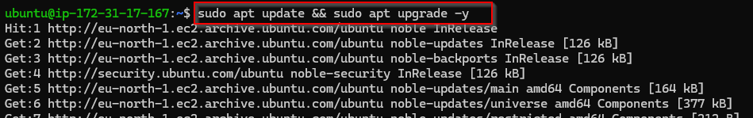

---

## 2️⃣ Install Apache

### Commands Used

```bash
sudo apt install apache2 -y
```

**Screenshot:**

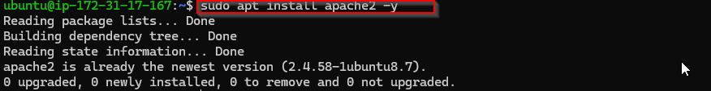

*Confirmed that the installation was successful

```bash
sudo systemctl status apache2
```

**Screenshot:**

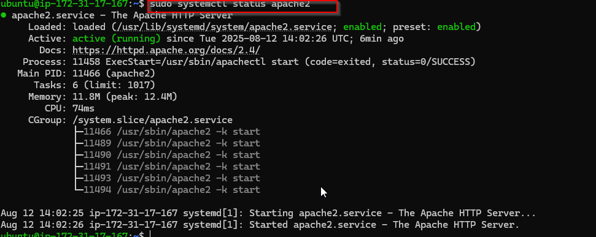

---

## 3️⃣ Configure Firewall for Apache

### Commands Used

* No commands were used for this step, instead I went to the security options and updated my security group to allow for SSH connections on TCP port 22 and HTTP transfers on port 80 from my IP

**Screenshot:**
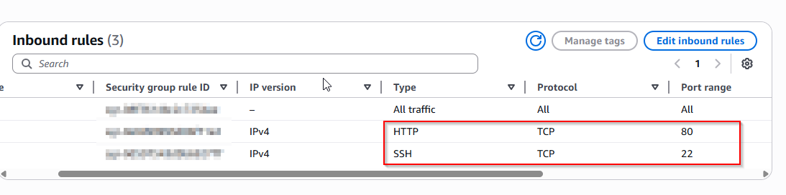


* Confirmed that the server was locally accesible using the curl command
### Commands Used
```bash
curl http://localhost:80

```
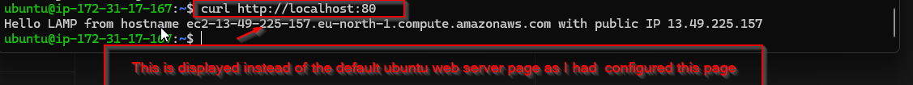
---

## 4️⃣ Install MySQL

### Commands Used

```bash
sudo apt install mysql-server -y

```

**Screenshot:**

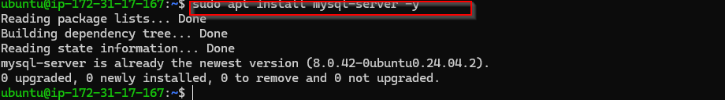

* When the installation is completed one can login to the mysql console using 
```bash
sudo mysql
```
**Screenshot:**

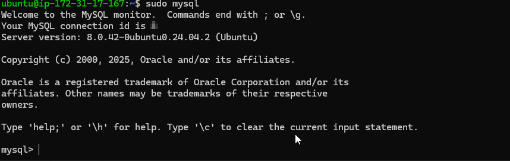

## 5️⃣ Secure MySQL Installation

### Commands Used

```bash
sudo mysql_secure_installation

```

**Screenshot:**
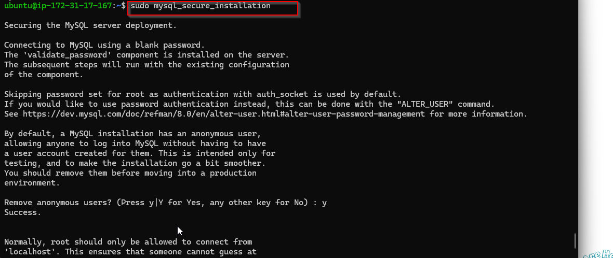

What It Does:
The mysql_secure_installation script helps improve the security of your database server by:

Setting a root password – Protects your root account.

Removing anonymous users – Prevents access without a username.

Disabling remote root login – Stops root from logging in over the network.

Removing test database – Eliminates an insecure default database.

Reloading privilege tables – Applies changes immediately.

---

## 6️⃣ Install PHP

### Commands Used

```bash
sudo apt install php libapache2-mod-php php-mysql -y
php -v
```

**Screenshot:**
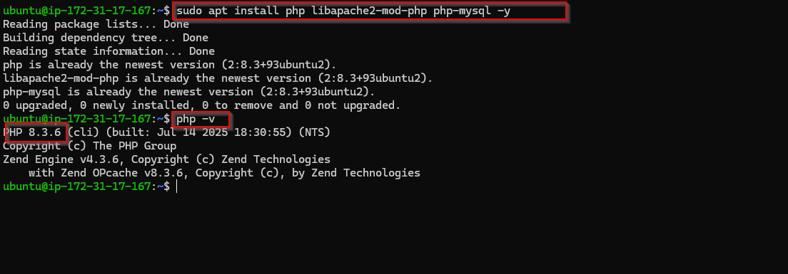

---

## 7️⃣ Create Apache Virtual Host

### Commands Used

```bash
sudo mkdir /var/www/mywebsite
sudo chown -R $USER:$USER /var/www/mywebsite
```

**Create Virtual Host Config File**

```bash
sudo vim /etc/apache2/sites-available/mywebsite.conf
```

Example content:

```
<VirtualHost *:80>
    ServerAdmin webmaster@localhost
    ServerName mywebsite.local
    DocumentRoot /var/www/mywebsite
    ErrorLog ${APACHE_LOG_DIR}/error.log
    CustomLog ${APACHE_LOG_DIR}/access.log combined
</VirtualHost>
```

**Enable Virtual Host**

```bash
sudo systemctl reload apache2
sudo a2ensite mywebsite.conf
sudo a2dissite 000-default.conf
sudo systemctl reload apache2
```
**Creating an index.html file to run**
* Run the following command to create an index.html file as the default landing page

```bash
TOKEN=$(curl -X PUT "http://169.254.169.254/latest/api/token" -H "X-aws-ec2-metadata-token-ttl-seconds: 21600" -s) && \
echo "Hello LAMP2 from $(curl -H "X-aws-ec2-metadata-token: $TOKEN" -s http://169.254.169.254/latest/meta-data/public-ho
stname) with public IP $(curl -H "X-aws-ec2-metadata-token: $TOKEN" -s http://169.254.169.254/latest/meta-data/public-ip
v4)" | \
sudo tee /var/www/mywebsite/index.html
```

**Screenshot:**
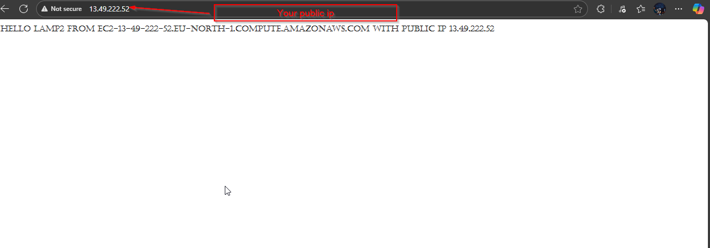

---

## 8️⃣ Enable PHP on Website
**Edit directory index**
* Open the dir.conf file
```bash
sudo vim /etc/apache2/mods-enabled/dir.conf
```
* Change the order so that index.php comes first
* Default settings look like:
```bash
DirectoryIndex index.html index.cgi index.pl index.php index.xhtml index.htm

```
* Update it to: 
```bash
DirectoryIndex index.php index.html index.cgi index.pl index.xhtml index.htm

```
* Save and exit

**Restart Apache**

```bash
sudo systemctl restart apache2
```

**Test PHP**
* Create a new file called index.php inside your root web folder

```bash
vim /var/www/mywebsite/index.php
```
* This will open a blank file, enter the following code on it and save

```bash
<?php
phpinfo();
```
* If you refresh the page after saving and closing you will see a page similar to the one below


**Screenshot:**
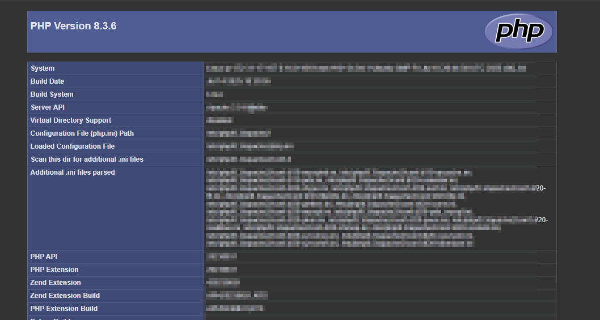

* It is advisable to delete this page after you are done as it reveals a lot of sensitive information about your system. You can always recreate it if you need to find out more information about your server and php configuration

---

## ✅ Conclusion

We have successfully:

* Installed and configured Apache
* Updated firewall rules
* Installed MySQL and PHP
* Created an Apache virtual host
* Enabled PHP on our website

## 🛠 Easy Troubleshooting

If you run into issues while running or connecting to your EC2-hosted project, try these quick fixes:

1. **Server Not Loading in Browser**
   - Make sure your EC2 instance is **running** in the AWS Console.
   - Check that the correct **inbound rules** (HTTP/HTTPS) are open in your Security Group.

2. **Cannot SSH into EC2 Instance**
   - Verify you’re using the correct `.pem` key file and correct **username** (`ec2-user`, `ubuntu`, etc.).
   - Ensure port **22** is open in your Security Group.
   - Check if your IP address has changed — update the Security Group rule if needed.

3. **Website Works Locally but Not on EC2**
   - Ensure your application is listening on `0.0.0.0` instead of `localhost` or `127.0.0.1`.
   - Restart the service:
     ```bash
     sudo systemctl restart <your-service-name>
     ```

4. **Changes Not Appearing**
   - Clear your browser cache or try in **incognito mode**.
   - Restart your web server:
     ```bash
     sudo systemctl restart apache2   # For Apache
     sudo systemctl restart nginx     # For Nginx
     ```

5. **High Costs or Unexpected Charges**
   - Stop your instance when you’re not using it.
   - Delete unused EBS volumes, snapshots, or Elastic IPs.

6. **EC2 Instance Feels Slow**
   - Check CPU and memory usage:
     ```bash
     top
     ```
   - Upgrade to a larger instance type if needed.


