# LEMP setup with Nginx Server Block
## 📌 Project Overview
* This project explores the installation and configuration of a LEMP stack (Linux, Nginx, MySQL, and PHP) on an Ubuntu server.

* We will also cover configuring an Nginx server block for a website and pulling data from a database to display on a PHP page.
---
## 📋 Prerequisites

Before starting this guide, make sure you have:

1. **An AWS Account**  
   - You’ll need access to the [AWS Management Console](https://aws.amazon.com/console/) to create and manage your EC2 instance.  

2. **An EC2 Instance (Ubuntu 22.04 LTS recommended)**  
   - Minimum: t2.micro (Free Tier eligible) with 1 vCPU and 1 GB RAM.  
   - Security group configured to allow:  
     - **SSH** (port 22) — for remote terminal access.  
     - **HTTP** (port 80) — for web traffic.  
     - **HTTPS** (port 443) — optional, for secure web traffic.  

3. **SSH Key Pair**  
   - Downloaded when creating your EC2 instance.  
   - Keep it safe — it’s your login credential.

4. **Basic Terminal Knowledge**  
   - Ability to navigate the terminal and run commands like `cd`, `ls`, `sudo`.  

5. **Local Machine Requirements**  
   - A terminal (Linux/Mac) or **PowerShell**/**WSL** (Windows). (For this project I used both git bash and powershell)  
   - **SSH client** installed (most systems have it by default).  

6. **Text Editor**  
   - [VS Code](https://code.visualstudio.com/) or any preferred editor for editing configuration files. (I was using nano on the Ubuntu server and VS code for the MD) 

7. **Stable Internet Connection**  
   - For installing packages and accessing your server remotely.

## 1️ System Update 

### Commands Used
```bash
sudo apt update && sudo apt upgrade -y
````

### Notes

* Keeps the server packages up to date before installing new software.

**Screenshot:**
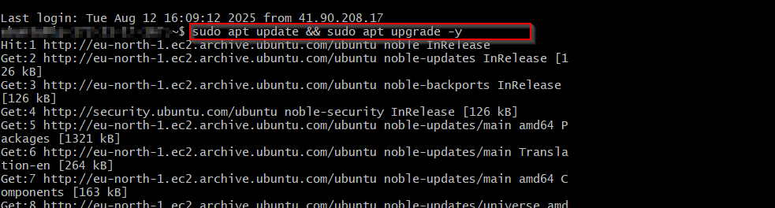

---

## 2 Installing The Nginx Web Server
* Nginx is the web server that will serve your site content to visitors.

### Commands Used

```bash
sudo apt install nginx -y
```

**Screenshot:**


* Confirmed that the installation was successful

```bash
sudo systemctl status nginx
```

**Screenshot:**

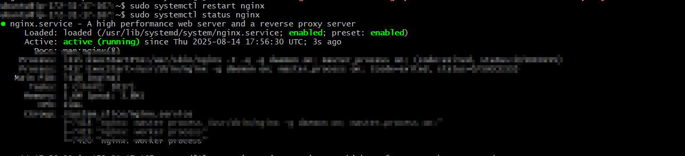

---


## 3 Installing MySQL
* You need to install a Database Management System (DBMS) to manage and store data for your site. MySQL is a reliable choice.

 ### Commands Used
 ``` bash
 sudo apt install mysql server
 ```
 **Screenshot:**

 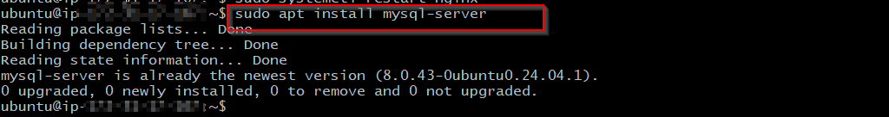
* As shown above, MySQL was already installed on my system.
* It’s recommended to run the MySQL security script to remove insecure default settings.

 ### Commands Used
 ``` bash
 sudo mysql_secure_installation

  ```
  ---

## 4 Installing PHP
* Nginx requires an external program to handle PHP processing.
* We’ll install php-fpm (FastCGI Process Manager) and php-mysql, which allows PHP to connect to MySQL databases.

 ### Commands Used
 ``` bash
 sudo apt install php-fpm php-mysql 

  ```
  * When prompted, type y and press enter to continue with installation
 **Screenshot:**

 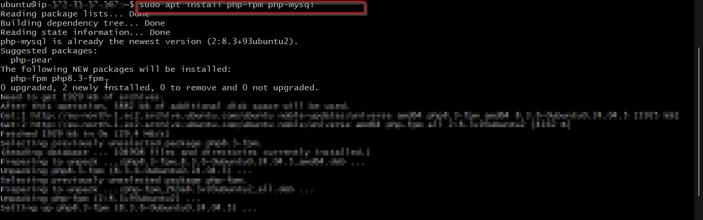
 ---

 ## 5 Configuring Nginx to use PHP processor
 * Create the root web directory for your domain as follows
 * Assign ownership of the directory with the $USER environment variable
 * Then, open a new configuration file in Nginx’s `sites-available directory` using your preferred command-line editor


 ### Commands Used
 ``` bash
 sudo mkdir /var/www/projectLEMP
 sudo chown -R $USER:$USER /var/www/projectLEMP
 sudo nano /etc/nginx/sites-available/projectLEMP
  ```

  * This will create a new blank file. Paste in the following bare-bones configuration:
 ``` bash
 server {
    listen 80;
    server_name projectLEMP www.projectLEMP;
    root /var/www/projectLEMP;

    index index.html index.htm index.php;

    location / {
        try_files $uri $uri/ =404;
    }

    location ~ \.php$ {
        include snippets/fastcgi-php.conf;
        fastcgi_pass unix:/var/run/php/php8.3-fpm.sock;
     }

    location ~ /\.ht {
        deny all;
    }

}
  ```
* Activate your configuration by linking to the config file from Nginx’s `sites-enabled directory`
* This will tell Nginx to use the configuration next time it is reloaded.
 ``` bash
 sudo ln -s /etc/nginx/sites-available/projectLEMP /etc/nginx/sites-enabled/
  ```
* You can test your configuration for syntax errors by typing:
 ``` bash
 sudo nginx -t
  ```

* You shall see following message:

**Screenshot:**

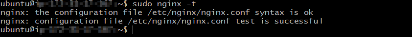

* We also need to disable default Nginx host that is currently configured to listen on port 80, for this run:

``` bash
 sudo unlink /etc/nginx/sites-enabled/default
  ```

* Reload Nginx to apply changes:
``` bash
sudo systemctl reload nginx
```

* Your new website is now live, but the web root directory `/var/www/projectLEMP` doesn’t contain any files yet. Add an `index.html` file to this location so we can confirm that the new server block is functioning correctly.

``` bash
 sudo bash -c echo "Hello LEMP from hostname $( 
    TOKEN=$(curl -s -X PUT "http://169.254.169.254/latest/api/token" \
        -H "X-aws-ec2-metadata-token-ttl-seconds: 21600") && 
    curl -s -H "X-aws-ec2-metadata-token: $TOKEN" \
        http://169.254.169.254/latest/meta-data/public-hostname
) with public IP $( 
    TOKEN=$(curl -s -X PUT "http://169.254.169.254/latest/api/token" \
        -H "X-aws-ec2-metadata-token-ttl-seconds: 21600") && 
    curl -s -H "X-aws-ec2-metadata-token: $TOKEN" \
        http://169.254.169.254/latest/meta-data/public-ipv4
)" > /var/www/projectLEMP/index.html

  ```

* Now go to your browser and try to open your website URL using IP address. You should see a page similar to the one below

**Screenshot:**

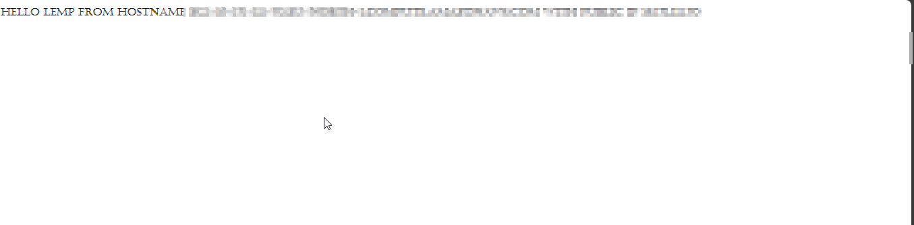


---

## 6 Testing PHP with Nginx
* You can verify that Nginx is correctly passing `.php` files to the PHP processor by creating a test PHP file in your document root.
* Open your text editor and create a new file named `info.php` inside the document root.
### Commands Used
```bash
nano /var/www/projectLEMP/info.php
```
* Type or paste the following lines into the new file. This is valid PHP code that will return information about your server:

```bash
<?php
phpinfo();
```
* You can view this page in your browser by navigating to the domain name or public IP address specified in your Nginx configuration, followed by `/info.php`.
* It is advisable to delete this page as soon as you have viewed the information you need to as it exposes sensitive information about your PHP environment and Ubuntu server. You can accomplish this with the following command
```bash
sudo rm /var/www/your_domain/info.php
```
---


**Screenshot:**

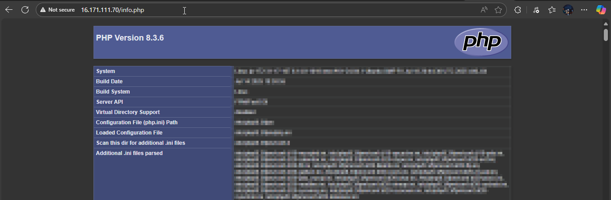

---
## 7 Retrieving data from MySQL Database with PHP
* In this step, you’ll set up a test database containing a simple “To-Do List” and configure access so your Nginx website can retrieve and display the data from it.
* To allow your PHP application to work with MySQL, you’ll need to create a database user and grant it the necessary permissions. This user will be used by PHP to connect to the MySQL database and perform queries.

* We will create a database named **test** and a user named **example_user**, but you can replace these names with different values.

* First, connect to the MySQL console using the **root** account:

```bash
$ sudo mysql
````

To create a new database, run the following command from your MySQL console:

```sql
mysql> CREATE DATABASE `test`;
```

* Now you can create a new user and grant them full privileges on the database you have just created.

* The following command creates a new user named `example_user`. We’re defining this user’s password as `PassWord.1`, but you should replace this value with a secure password of your own choosing:

```sql
mysql> CREATE USER 'example_user'@'%' IDENTIFIED BY 'PassWord.1';
```

* Now we need to give this user permission over the `test` database:

```sql
mysql> GRANT ALL ON test.* TO 'example_user'@'%';
```

* This will give the **example\_user** user full privileges over the **test** database, while preventing this user from creating or modifying other databases on your server.

* Now exit the MySQL shell with:

```sql
mysql> exit
```

* You can test if the new user has the proper permissions by logging in to the MySQL console again, this time using the custom user credentials:

```bash
$ mysql -u example_user -p
```

* Notice the `-p` flag in this command, which will prompt you for the password used when creating the `example_user` user.
* After logging in to the MySQL console, confirm that you have access to the `test` database:

```sql
mysql> SHOW DATABASES;
```

* This will give you the following output:

```
+--------------------+
| Database           |
+--------------------+
| information_schema |
| performace_schema  |
| test               |
+--------------------+
```
**Screenshot:**

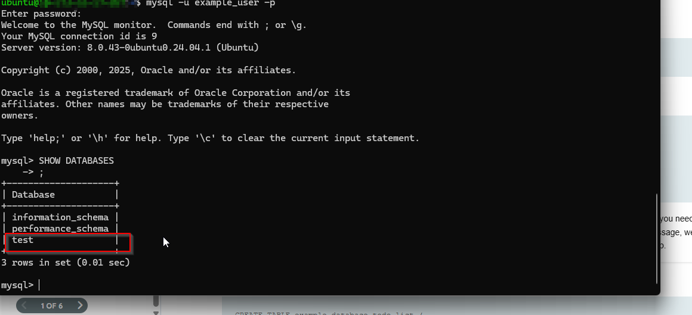


* Next, we’ll create a test table named **todo_list**. From the MySQL console, run the following statement:

```sql
mysql> use test;
mysql> CREATE TABLE todo_list (
    -> item_id INT AUTO_INCREMENT,
    -> content VARCHAR(255),
    -> PRIMARY KEY(item_id)
    -> );
````

* Insert a few rows of content into the test table. You can repeat the next command several times, using different values:

```sql
mysql> INSERT INTO todo_list (content) VALUES ("My first important item");
```

* To confirm that the data was successfully saved to your table, run:

```sql
mysql> SELECT * FROM todo_list;
```

* You’ll see output similar to the following:

```
+---------+--------------------------+
| item_id | content                  |
+---------+--------------------------+
|       1 | My first important item  |
|       2 | My second important item |
|       3 | My third item            |
+---------+--------------------------+
4 rows in set (0.000 sec)
```

* After confirming that you have valid data in your test table, you can exit the MySQL console:

```sql
mysql> exit
```
**Screenshot:**

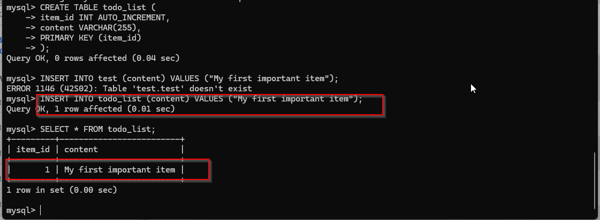
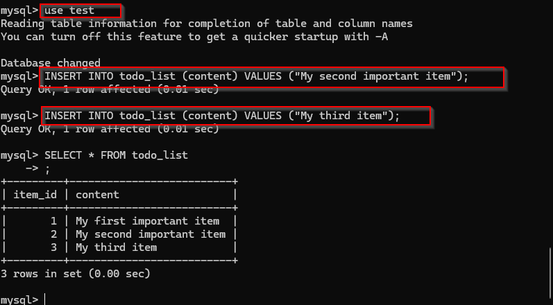


* Next, let’s create a PHP script that connects to MySQL and displays the items from our table.  
* We’ll place the script in the custom web root directory.  
* In this example, we’ll open a new file using `nano`:

```bash
$ nano /var/www/projectLEMP/todo_list.php
````

* The script below connects to the **test** database, retrieves all rows from the **todo\_list** table, and displays them in an ordered list.
* If the connection fails, it will display an error message.

* Paste the following code into `todo_list.php`:

```php
<?php
$user = "example_user";
$password = "PassWord.1";
$database = "test";
$table = "todo_list";

try {
  $db = new PDO("mysql:host=localhost;dbname=$database", $user, $password);
  echo "<h2>TODO</h2><ol>";
  foreach ($db->query("SELECT content FROM $table") as $row) {
    echo "<li>" . htmlspecialchars($row['content']) . "</li>";
  }
  echo "</ol>";
} catch (PDOException $e) {
    echo "Error!: " . $e->getMessage() . "<br/>";
    die();
}
```

* Save and close the file when finished.

* To test it, open your browser and visit:

```
http://<Public_domain_or_IP>/todo_list.php
```

* If everything is set up correctly, you’ll see a page listing the items you added to your **todo\_list** table.

**Screenshot:**


* This confirms that PHP is able to connect to your MySQL database and retrieve data successfully.


## Troubleshooting Problems
* An error I enccountered in this process was the nginx server failing to start because port 80 was being used by another project

**Screenshot:**

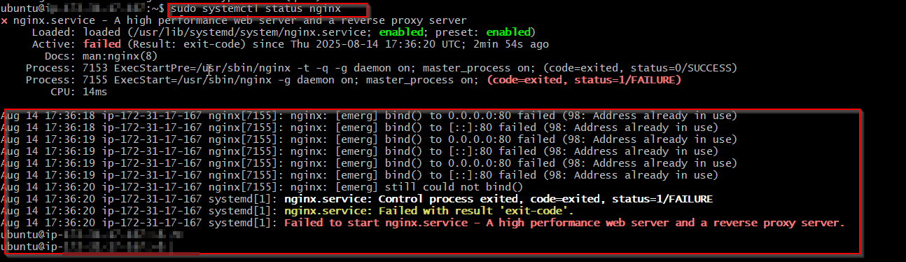

* There are two possible fixes for this error. Changing the default port used by nginx or stopping the conflicting process
* In my case as it is the apache server running on the port I can simply stop the process and use the port

**Solutions:**

* Stop the conflicting process (e.g., Apache):

  ```bash
  sudo systemctl stop apache2
  ```
* Or check which process is using port 80:

  ```bash
  sudo lsof -i :80
  ```

---


---