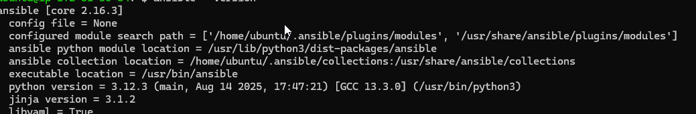

# Ansible Configuration Management - Step by Step Guide

This guide walks through setting up Ansible configuration management for a multi-server environment.

## 📋 Prerequisites

- Ubuntu-based Ansible control node
- Target servers: 2 RHEL, 2 Ubuntu
- SSH access between servers
- GitHub repository

## 🚀 Step-by-Step Setup

### Step 1: Install Ansible on Control Node

```bash
# Update package list
sudo apt update

# Install Ansible
sudo apt install ansible -y

# Verify installation
ansible --version
```



### Step 2: Set Up SSH Agent and Keys (The Way We Did It)

```bash
# Start SSH agent service
sudo systemctl enable ssh-agent
sudo systemctl start ssh-agent

# Add your private key to SSH agent
ssh-add ~/.ssh/id_rsa

# Verify key was added
ssh-add -l

# Test SSH to each server with agent forwarding
ssh -A ec2-user@172.31.28.178 "echo 'NFS server test'"
ssh -A ec2-user@172.31.42.57 "echo 'Web server 1 test'"
ssh -A ec2-user@172.31.36.78 "echo 'Web server 2 test'"
ssh -A ubuntu@172.31.40.177 "echo 'Database server test'"
ssh -A ubuntu@172.31.22.195 "echo 'Load balancer test'"
```

**If you get permission denied on any server, transfer your key:**

```bash
# From your local machine, transfer the key to Jenkins server
scp -i "C:\users\user\Downloads\mern_key_pair.pem" "C:\users\user\Downloads\mern_key_pair.pem" ubuntu@YOUR_JENKINS_IP:/home/ubuntu/.ssh/

# On Jenkins server, set proper permissions
chmod 600 /home/ubuntu/.ssh/mern_key_pair.pem

# Add the specific key to SSH agent
ssh-add /home/ubuntu/.ssh/mern_key_pair.pem
```

### Step 3: Create Project Structure

```bash
# Create project directory
mkdir ansible-config-mgt
cd ansible-config-mgt

# Initialize git repository
git init

# Create directory structure
mkdir -p inventory playbooks

# Create inventory files
touch inventory/dev inventory/staging inventory/uat inventory/prod

# Create playbooks directory
touch playbooks/common.yml
```

### Step 4: Configure Inventory

Edit `inventory/dev`:

```ini
[nfs]
<NFS-SERVER-PRIVATE-IP> ansible_ssh_user=ec2-user

[webservers]
<WEB1-SERVER-PRIVATE-IP> ansible_ssh_user=ec2-user
<WEB2-SERVER-PRIVATE-IP> ansible_ssh_user=ec2-user

[db]
<DB-SERVER-PRIVATE-IP> ansible_ssh_user=ubuntu

[lb]
<LB-SERVER-PRIVATE-IP> ansible_ssh_user=ubuntu

[all:vars]
ansible_python_interpreter=/usr/bin/python3
timezone=UTC
```

### Step 5: Create Ansible Configuration

Create `ansible.cfg`:

```ini
[defaults]
host_key_checking = False
private_key_file = /home/ubuntu/.ssh/id_rsa

[ssh_connection]
ssh_args = -o ControlMaster=auto -o ControlPersist=60s -o UserKnownHostsFile=/dev/null -o StrictHostKeyChecking=no -o ConnectTimeout=30
```

**If using a different key, update the path:**
```ini
private_key_file = /home/ubuntu/.ssh/mern_key_pair.pem
```

### Step 6: Create Common Playbook

Edit `playbooks/common.yml`:

```yaml
---
- name: Update RHEL-based servers (nfs, webservers)
  hosts: nfs,webservers
  become: yes
  tasks:
    - name: ensure wireshark is at the latest version
      yum:
        name: wireshark
        state: latest

    - name: create a custom directory
      file:
        path: /opt/mydirectory
        state: directory
        mode: '0755'

    - name: create a file in the custom directory
      copy:
        content: "This file was created by Ansible\n"
        dest: /opt/mydirectory/ansible-created-file.txt
        mode: '0644'

    - name: set timezone to UTC
      timezone:
        name: UTC

- name: Update Ubuntu-based servers (db, lb)
  hosts: db,lb
  become: yes
  tasks:
    - name: Update apt repo
      apt: 
        update_cache: yes

    - name: ensure wireshark is at the latest version
      apt:
        name: wireshark
        state: latest

    - name: create a custom directory
      file:
        path: /opt/mydirectory
        state: directory
        mode: '0755'

    - name: create a file in the custom directory
      copy:
        content: "This file was created by Ansible\n"
        dest: /opt/mydirectory/ansible-created-file.txt
        mode: '0644'

    - name: set timezone to UTC
      timezone:
        name: UTC
```

### Step 7: Test Connectivity

```bash
# Test SSH connectivity to all servers using SSH agent
ansible -i inventory/dev all -m ping

# Expected output: All servers should return "pong"
```

### Step 8: Run Playbook in Check Mode

```bash
# Dry run to see what changes will be made
ansible-playbook -i inventory/dev playbooks/common.yml --check
```

### Step 9: Execute the Playbook

```bash
# Run the playbook for real
ansible-playbook -i inventory/dev playbooks/common.yml
```

### Step 10: Verify Deployment

```bash
# Check if directories were created on all servers
ansible -i inventory/dev all -a "ls -la /opt/mydirectory/"

# Check file content
ansible -i inventory/dev all -a "cat /opt/mydirectory/ansible-created-file.txt"

# Verify timezone setting
ansible -i inventory/dev all -a "timedatectl | grep Timezone || date"
```

### Step 11: Verify Wireshark Installation

```bash
# Check wireshark installation on Ubuntu servers
ansible -i inventory/dev db,lb -a "which wireshark"

# Check package installation on RHEL servers
ansible -i inventory/dev nfs,webservers -m shell -a "rpm -q wireshark || echo 'Wireshark not in default RHEL repos'"
```


### Step 12: Git Workflow

```bash
# Add all files to git
git add .

# Commit changes
git commit -m "feat: Complete Ansible configuration management setup"

# Create and switch to feature branch
git checkout -b feature/ansible-setup

# Push to GitHub
git push origin feature/ansible-setup
```

### Step 13: Create Pull Request

1. Go to your GitHub repository
2. Create a Pull Request from `feature/ansible-setup` to `main`
3. Add description of changes
4. Merge the PR

### Step 14: Update Local Repository

```bash
# Switch to main branch
git checkout main

# Pull latest changes
git pull origin main

# Verify everything still works
ansible-playbook -i inventory/dev playbooks/common.yml --check
```

## ✅ Final Verification

After completing all steps, verify your setup with these commands:

```bash
# 1. Verify Ansible version
ansible --version

# 2. Verify all servers are reachable
ansible -i inventory/dev all -m ping

# 3. Verify files were created
ansible -i inventory/dev all -a "ls -la /opt/mydirectory/"

# 4. FINAL VERIFICATION: Confirm wireshark installation on database server
ansible -i inventory/dev db -a "which wireshark"
```

**Expected output for final verification:**
```
172.31.40.177 | CHANGED | rc=0 >>
/usr/bin/wireshark
```

## 🐛 Troubleshooting

### SSH Agent Issues

**If SSH agent stops working:**
```bash
# Restart SSH agent
pkill ssh-agent
eval "$(ssh-agent -s)"
ssh-add ~/.ssh/id_rsa

# Or if using a specific key:
ssh-add /home/ubuntu/.ssh/mern_key_pair.pem
```

**If you get "Permission denied" on specific servers:**
```bash
# Test that server manually
ssh -A -v ec2-user@PROBLEM_SERVER_IP

# Check if the server uses a different user
ssh -A ubuntu@PROBLEM_SERVER_IP
```

### Common Issues and Solutions

**SSH Connection Failed:**
- Verify SSH agent is running: `ssh-add -l`
- Check key permissions: `chmod 600 ~/.ssh/*`
- Ensure servers are running and accessible

**Permission Denied:**
- Verify user assignments in inventory file
- Check the server actually uses the specified user
- Test manual SSH connection first

**Package Installation Failed:**
- RHEL: Some packages may not be in default repositories
- Ubuntu: Run `apt update` first

**Playbook Syntax Errors:**
- Validate YAML syntax: `ansible-playbook --syntax-check playbooks/common.yml`
- Check indentation and spacing

## 🏗️ Project Structure

```
ansible-config-mgt/
├── inventory/
│   ├── dev           # Development environment
│   ├── staging       # Staging environment
│   ├── uat           # User Acceptance Testing
│   └── prod          # Production environment
├── playbooks/
│   └── common.yml    # Common configuration playbook
├── ansible.cfg       # Ansible configuration
└── README.md         # This file
```

## 🎯 Summary

This setup provides:
- Automated configuration management for 5 servers using SSH agent forwarding
- Multi-OS support (RHEL and Ubuntu)
- Package management, file deployment, and system configuration
- Git-based workflow for infrastructure as code
- Scalable inventory structure for multiple environments

Your Ansible configuration management system is now ready for production use!

---

**Last Updated**: November 2025  
