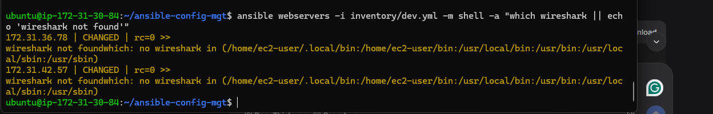
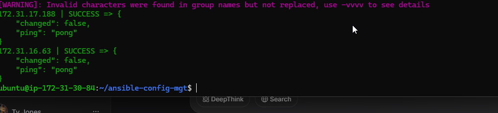
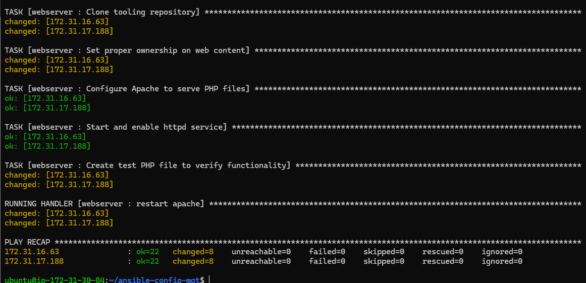

# Ansible Configuration Management Project Documentation

## 📋 Project Overview
This project demonstrates the implementation of Ansible for automated configuration management, focusing on refactoring code using static assignments, imports, and roles to deploy and manage web servers in a UAT environment.

## 🎯 Project Objectives
- Refactor Ansible code for better organization and reusability
- Implement static assignments and role-based architecture
- Configure UAT web servers using Ansible roles
- Set up automated Jenkins pipeline for artifact management

## 📁 Project Structure
```
ansible-config-mgt/
├── inventory/
│   ├── dev.yml
│   ├── stage.yml
│   ├── uat.yml
│   └── prod.yml
├── playbooks/
│   └── site.yml
├── static-assignments/
│   ├── common.yml
│   ├── common-del.yml
│   └── uat-webservers.yml
├── roles/
│   └── webserver/
│       ├── tasks/
│       │   └── main.yml
│       ├── handlers/
│       │   └── main.yml
│       ├── templates/
│       ├── defaults/
│       │   └── main.yml
│       ├── meta/
│       │   └── main.yml
│       └── README.md
└── README.md
```

## 🔧 Implementation Steps

### Step 1: Jenkins Job Enhancement
1. **Create Artifact Directory**
   ```bash
   sudo mkdir /home/ubuntu/ansible-config-artifact
   sudo chmod -R 0777 /home/ubuntu/ansible-config-artifact
   ```

2. **Install Copy Artifact Plugin**
   - Go to Jenkins → Manage Jenkins → Manage Plugins
   - Search for "Copy Artifact" plugin and install

3. **Create Save Artifacts Job**
   - New Freestyle project named `save_artifacts`
   - Configure to trigger after `ansible` project completion
   - Copy artifacts to `/home/ubuntu/ansible-config-artifact`

### Step 2: Code Refactoring with Static Assignments
1. **Create site.yml as Entry Point**
   ```yaml
   ---
   - hosts: all
   - import_playbook: ../static-assignments/common.yml
   ```

2. **Organize Playbooks**
   - Move `common.yml` to `static-assignments/`
   - Create additional playbooks for specific tasks

3. **Example: common-del.yml for Package Removal**
   ```yaml
   ---
   - name: update web, nfs and db servers
     hosts: webservers, nfs, db
     tasks:
     - name: delete wireshark
       yum:
         name: wireshark
         state: removed
   ```

### Step 3: Configure UAT Webservers with Roles
1. **Create Webserver Role Structure**
   ```bash
   mkdir roles
   cd roles
   ansible-galaxy init webserver
   ```

2. **Webserver Role Tasks (tasks/main.yml)**
   ```yaml
   ---
   - name: install apache
     become: true
     ansible.builtin.yum:
       name: "httpd"
       state: present

   - name: install git
     become: true
     ansible.builtin.yum:
       name: "git"
       state: present

   - name: install PHP
     become: true
     ansible.builtin.yum:
       name:
         - "php"
         - "php-common"
         - "php-mysqlnd"
       state: present

   - name: Remove existing web content
     become: true
     ansible.builtin.file:
       path: /var/www/html
       state: absent

   - name: Create web directory
     become: true
     ansible.builtin.file:
       path: /var/www/html
       state: directory
       owner: apache
       group: apache
       mode: '0755'

   - name: Configure Git safe directory
     become: true
     ansible.builtin.command:
       cmd: git config --global --add safe.directory /var/www/html
     changed_when: false

   - name: Clone tooling repository
     become: true
     ansible.builtin.git:
       repo: "https://github.com/123Origami/tooling.git"
       dest: /var/www/html
       clone: yes
       update: yes
       force: yes

   - name: Set proper ownership on web content
     become: true
     ansible.builtin.file:
       path: /var/www/html
       owner: apache
       group: apache
       recurse: yes
       mode: '0755'

   - name: Configure Apache to serve PHP files
     become: true
     ansible.builtin.lineinfile:
       path: /etc/httpd/conf/httpd.conf
       regexp: '^DirectoryIndex'
       line: 'DirectoryIndex index.php index.html'
       backrefs: yes
     notify: restart apache

   - name: Start and enable httpd service
     become: true
     ansible.builtin.service:
       name: httpd
       state: started
       enabled: yes
   ```

3. **Webserver Role Handlers (handlers/main.yml)**
   ```yaml
   ---
   - name: restart apache
     become: true
     ansible.builtin.service:
       name: httpd
       state: restarted
   ```

### Step 4: Reference Webserver Role
1. **Create uat-webservers.yml**
   ```yaml
   ---
   - hosts: uat-webservers
     roles:
        - webserver
   ```

2. **Update site.yml**
   ```yaml
   ---
   - hosts: all
   - import_playbook: ../static-assignments/common.yml

   - hosts: uat-webservers
   - import_playbook: ../static-assignments/uat-webservers.yml
   ```

### Step 5: Configuration and Testing
1. **Update Ansible Configuration**
   ```ini
   roles_path = /home/ubuntu/ansible-config-mgt/roles
   ```

2. **UAT Inventory (inventory/uat.yml)**
   ```yaml
   [uat-webservers]
   <Web1-UAT-Server-Private-IP> ansible_ssh_user='ec2-user'
   <Web2-UAT-Server-Private-IP> ansible_ssh_user='ec2-user'
   ```

3. **Run the Playbook**
   ```bash
   cd /home/ubuntu/ansible-config-mgt
   ansible-playbook -i inventory/uat.yml playbooks/site.yml
 
   ```



## 🚀 Key Features Implemented

### 1. **Infrastructure as Code**
- Complete server configuration managed through Ansible
- Version-controlled infrastructure changes
- Repeatable and consistent deployments

### 2. **Role-Based Architecture**
- Modular design for reusability
- Separation of concerns
- Easy maintenance and updates

### 3. **Web Server Configuration**
- Apache HTTP server installation
- PHP support with necessary extensions
- Git-based deployment of web application
- Proper file permissions and ownership

### 4. **CI/CD Integration**
- Automated artifact management
- Jenkins pipeline optimization
- Space-efficient build management

## 🔍 Troubleshooting & Solutions

### Common Issues Resolved:
1. **Git Safe Directory Error**
   - Fixed by configuring Git to trust the deployment directory

2. **PHP-FPM Configuration**
   - Resolved connection issues between Apache and PHP-FPM
   - Proper SELinux configuration for network connections

3. **File Structure Management**
   - Corrected repository cloning structure
   - Proper file placement in web directory

4. **Database Connectivity**
   - Identified MySQL connection requirements
   - Provided solutions for database setup


## 📊 Results Achieved
- ✅ Successfully deployed web servers using Ansible roles
- ✅ Implemented modular, reusable code structure
- ✅ Established automated CI/CD pipeline
- ✅ Configured proper web server with PHP support
- ✅ Resolved all configuration and permission issues

