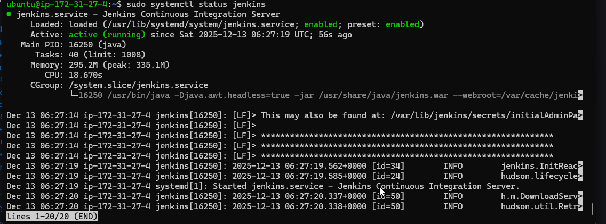
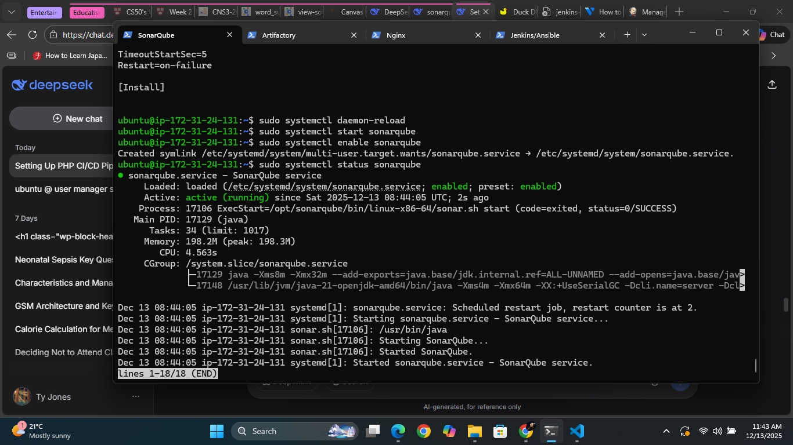
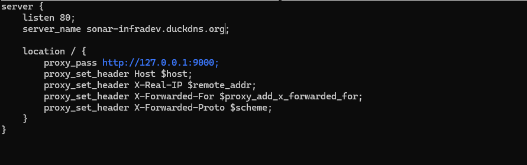

# **Project 14: PHP CI/CD Pipeline with Jenkins, Ansible, Artifactory & SonarQube**

## **📋 Project Overview**
A complete end-to-end CI/CD pipeline for PHP applications using modern DevOps tools. This project simulates enterprise-grade continuous integration and continuous delivery for PHP-based applications (Tooling and TODO apps).

---

## **🎯 Architecture Overview**

```
GitHub (Code) → Jenkins (CI/CD) → SonarQube (Quality Gate) → Artifactory (Artifact Storage) → Ansible (Deployment) → Environments (Dev/SIT/UAT/Prod)
```

### **Environment Structure:**
```
┌─────────────────────────────────────────────────────────┐
│                     CI Environment                       │
│  Jenkins + SonarQube + Artifactory + Nginx Reverse Proxy│
└─────────────────────────────────────────────────────────┘
                              │
                              ▼
┌─────────────────────────────────────────────────────────┐
│                   Dev Environment                        │
│  Nginx + PHP Web Servers (Tooling & Todo) + MySQL DB    │
└─────────────────────────────────────────────────────────┘
                              │
                              ▼
┌─────────────────────────────────────────────────────────┐
│          SIT → UAT → Pentest → Pre-Prod → Prod          │
│              (Multi-environment pipeline)                │
└─────────────────────────────────────────────────────────┘
```

---

## **🛠️ Prerequisites**

### **AWS/GCP Account Requirements**
- Free tier AWS account OR GCP with $300 credit
- SSH key pair (.pem file)
- Basic knowledge of EC2 instance creation

### **Tools Required Locally**
- SSH client (OpenSSH, PuTTY)
- Git
- Web browser
- Text editor (VS Code recommended)

---

## **🏗️ Infrastructure Setup**

### **Server Specifications (AWS EC2)**

| Server Type | Instance | RAM | Storage | OS | Count |
|-------------|----------|-----|---------|----|-------|
| **CI Servers** | t2.medium | 4GB | 20GB | Ubuntu 20.04 | 4 |
| **Dev Servers** | t2.micro | 1GB | 10GB | Ubuntu 20.04 | 4 |
| **Jenkins Agents** | t2.micro | 1GB | 10GB | Ubuntu 20.04 | 2 |

### **Security Groups Configuration**

#### **Jenkins Server Security Group:**
```bash
Port 22 (SSH) - Your IP only
Port 8080 (Jenkins UI) - Your IP only
Port 50000 (Jenkins Agents) - Jenkins Agents IPs
```

#### **SonarQube Server Security Group:**
```bash
Port 22 (SSH) - Your IP only
Port 9000 (SonarQube) - Jenkins Server IP
```

#### **Artifactory Server Security Group:**
```bash
Port 22 (SSH) - Your IP only
Port 8081/8082 (Artifactory) - Jenkins Server IP
```

#### **Web Servers Security Group:**
```bash
Port 22 (SSH) - Jenkins Server IP
Port 80 (HTTP) - 0.0.0.0/0
Port 443 (HTTPS) - 0.0.0.0/0
```

---

## **🚀 Step-by-Step Implementation Guide**

### **Phase 1: Server Provisioning & Initial Setup**

#### **1.1 Create EC2 Instances**
```bash
# Create 10 EC2 instances with these names:
1. jenkins-ci-server
2. sonarqube-server
3. artifactory-server
4. nginx-ci-proxy
5. tooling-dev-server
6. todo-dev-server
7. mysql-dev-server
8. nginx-dev-proxy
9. jenkins-agent-1
10. jenkins-agent-2
```

#### **1.2 Initial Server Configuration (All Servers)**
```bash
# Connect to each server
ssh -i your-key.pem ubuntu@server-ip

# Run initial setup script
sudo apt update && sudo apt upgrade -y
sudo apt install -y wget curl git unzip vim htop net-tools

# Set hostnames
sudo hostnamectl set-hostname jenkins-ci-server  # For Jenkins server
# Repeat for other servers with appropriate hostnames
```

---

### **Phase 2: Jenkins Server Setup**

#### **2.1 Install Jenkins**
```bash
# On jenkins-ci-server
sudo apt install -y openjdk-11-jdk
wget -q -O - https://pkg.jenkins.io/debian-stable/jenkins.io.key | sudo apt-key add -
sudo sh -c 'echo deb https://pkg.jenkins.io/debian-stable binary/ > /etc/apt/sources.list.d/jenkins.list'
sudo apt update
sudo apt install -y jenkins
sudo systemctl start jenkins
sudo systemctl enable jenkins

# Get initial password
sudo cat /var/lib/jenkins/secrets/initialAdminPassword
```

#### **2.2 Access Jenkins UI**
1. Open browser: `http://<jenkins-ip>:8080`
2. Enter initial admin password
3. Install suggested plugins
4. Create admin user
5. Save Jenkins URL as `http://ci.infradev.yourdomain.com:8080`

#### **2.3 Install Required Jenkins Plugins**
Navigate to: `Manage Jenkins` → `Manage Plugins` → `Available`

**Essential Plugins:**
- Blue Ocean
- Pipeline
- GitHub
- Ansible
- SonarQube Scanner
- Artifactory
- Plot
- HTML Publisher
- Warnings Next Generation
- SSH Agent

#### **2.4 Configure Global Tools**
`Manage Jenkins` → `Global Tool Configuration`

**Java:**
- Name: `jdk11`
- JAVA_HOME: `/usr/lib/jvm/java-11-openjdk-amd64`

**Git:**
- Name: `Default`
- Path: `git`

**SonarQube Scanner:**
- Name: `SonarQubeScanner`
- Install automatically

**Maven:**
- Name: `maven-default`
- Install automatically

---

### **Phase 3: SonarQube Setup**

#### **3.1 Install SonarQube on sonarqube-server**
```bash
# Install dependencies
sudo apt install -y wget unzip
sudo apt install -y openjdk-11-jdk

# Install PostgreSQL
sudo sh -c 'echo "deb http://apt.postgresql.org/pub/repos/apt $(lsb_release -cs)-pgdg main" > /etc/apt/sources.list.d/pgdg.list'
wget -q https://www.postgresql.org/media/keys/ACCC4CF8.asc -O - | sudo apt-key add -
sudo apt update
sudo apt install -y postgresql postgresql-contrib

# Configure PostgreSQL
sudo systemctl start postgresql
sudo systemctl enable postgresql
sudo -u postgres psql
```

**PostgreSQL Commands:**
```sql
CREATE DATABASE sonarqube;
CREATE USER sonarqube WITH ENCRYPTED PASSWORD 'sonar@123';
GRANT ALL PRIVILEGES ON DATABASE sonarqube TO sonarqube;
\q
```

#### **3.2 Configure System for SonarQube**
```bash
# Increase system limits
sudo sysctl -w vm.max_map_count=262144
echo "vm.max_map_count=262144" | sudo tee -a /etc/sysctl.conf
echo "fs.file-max=65536" | sudo tee -a /etc/sysctl.conf
sudo sysctl -p

# Create sonar user
sudo groupadd sonar
sudo useradd -c "SonarQube" -d /opt/sonarqube -g sonar sonar
```

#### **3.3 Install SonarQube**
```bash
cd /tmp
wget https://binaries.sonarsource.com/Distribution/sonarqube/sonarqube-9.9.0.65466.zip
sudo unzip sonarqube-9.9.0.65466.zip -d /opt
sudo mv /opt/sonarqube-9.9.0.65466 /opt/sonarqube
sudo chown -R sonar:sonar /opt/sonarqube
```

#### **3.4 Configure SonarQube**
```bash
sudo nano /opt/sonarqube/conf/sonar.properties
```

**Add/Modify:**
```properties
sonar.jdbc.username=sonarqube
sonar.jdbc.password=sonar@123
sonar.jdbc.url=jdbc:postgresql://localhost:5432/sonarqube
sonar.web.host=0.0.0.0
sonar.web.port=9000
```

#### **3.5 Create Systemd Service**
```bash
sudo nano /etc/systemd/system/sonarqube.service
```

**Content:**
```ini
[Unit]
Description=SonarQube service
After=syslog.target network.target

[Service]
Type=forking
User=sonar
Group=sonar
ExecStart=/opt/sonarqube/bin/linux-x86-64/sonar.sh start
ExecStop=/opt/sonarqube/bin/linux-x86-64/sonar.sh stop
LimitNOFILE=65536
LimitNPROC=4096

[Install]
WantedBy=multi-user.target
```

#### **3.6 Start SonarQube**
```bash
sudo systemctl daemon-reload
sudo systemctl start sonarqube
sudo systemctl enable sonarqube
sudo systemctl status sonarqube

# Check logs
sudo tail -f /opt/sonarqube/logs/sonar.log
```

#### **3.7 Configure Nginx Reverse Proxy**
```bash
sudo apt install -y nginx
sudo nano /etc/nginx/sites-available/sonar
```

**Nginx Configuration:**
```nginx
server {
    listen 80;
    server_name sonar.infradev.yourdomain.com;

    location / {
        proxy_pass http://127.0.0.1:9000;
        proxy_set_header Host $host;
        proxy_set_header X-Real-IP $remote_addr;
        proxy_set_header X-Forwarded-For $proxy_add_x_forwarded_for;
        proxy_set_header X-Forwarded-Proto $scheme;
    }
}
```



```bash
sudo ln -s /etc/nginx/sites-available/sonar /etc/nginx/sites-enabled/
sudo nginx -t
sudo systemctl restart nginx
```

---

### **Phase 4: Artifactory Setup**

#### **4.1 Install Artifactory on artifactory-server**
```bash
# Install Java
sudo apt install -y openjdk-11-jdk

# Download Artifactory OSS
cd /tmp
wget https://releases.jfrog.io/artifactory/bintray-artifactory/org/artifactory/oss/jfrog-artifactory-oss/7.41.13/jfrog-artifactory-oss-7.41.13-linux.tar.gz
tar -xvf jfrog-artifactory-oss-7.41.13-linux.tar.gz
sudo mv artifactory-oss-7.41.13 /opt/artifactory

# Create user
sudo useradd -r -m -U -d /opt/artifactory artifactory
sudo chown -R artifactory:artifactory /opt/artifactory
```

#### **4.2 Create Systemd Service**
```bash
sudo nano /etc/systemd/system/artifactory.service
```

**Content:**
```ini
[Unit]
Description=JFrog Artifactory Service
After=network.target

[Service]
Type=forking
User=artifactory
ExecStart=/opt/artifactory/app/bin/artifactory.sh start
ExecStop=/opt/artifactory/app/bin/artifactory.sh stop
Restart=on-failure

[Install]
WantedBy=multi-user.target
```

#### **4.3 Start Artifactory**
```bash
sudo systemctl daemon-reload
sudo systemctl start artifactory
sudo systemctl enable artifactory
sudo systemctl status artifactory
```

#### **4.4 Configure Nginx for Artifactory**
```bash
sudo nano /etc/nginx/sites-available/artifactory
```

**Nginx Configuration:**
```nginx
server {
    listen 80;
    server_name artifacts.infradev.yourdomain.com;

    location / {
        proxy_pass http://127.0.0.1:8081;
        proxy_set_header Host $host;
        proxy_set_header X-Real-IP $remote_addr;
        proxy_set_header X-Forwarded-For $proxy_add_x_forwarded_for;
        proxy_set_header X-Forwarded-Proto $scheme;
    }
}
```

```bash
sudo ln -s /etc/nginx/sites-available/artifactory /etc/nginx/sites-enabled/
sudo nginx -t
sudo systemctl restart nginx
```

---

### **Phase 5: Ansible Project Setup**

#### **5.1 Create Ansible Project Structure**
**On Jenkins server:**
```bash
mkdir -p ~/ansible-project
cd ~/ansible-project

# Directory structure
mkdir -p deploy inventories group_vars roles playbooks
```

#### **5.2 Create Inventory Files**
**`~/ansible-project/inventories/ci`:**
```ini
[jenkins]
<jenkins-server-ip> ansible_user=ubuntu

[nginx]
<nginx-ci-proxy-ip> ansible_user=ubuntu

[sonarqube]
<sonarqube-server-ip> ansible_user=ubuntu

[artifact_repository]
<artifactory-server-ip> ansible_user=ubuntu
```

**`~/ansible-project/inventories/dev`:**
```ini
[tooling]
<tooling-dev-server-ip> ansible_user=ubuntu

[todo]
<todo-dev-server-ip> ansible_user=ubuntu

[nginx]
<nginx-dev-proxy-ip> ansible_user=ubuntu

[db:vars]
ansible_user=ubuntu
ansible_python_interpreter=/usr/bin/python3

[db]
<mysql-dev-server-ip> ansible_user=ubuntu
```

#### **5.3 Create Ansible Configuration**
**`~/ansible-project/ansible.cfg`:**
```ini
[defaults]
host_key_checking = False
inventory = ./inventories/
roles_path = ./roles
retry_files_enabled = False
stdout_callback = yaml

[ssh_connection]
ssh_args = -o ControlMaster=auto -o ControlPersist=60s
pipelining = True
```

#### **5.4 Create Ansible Roles**
```bash
cd ~/ansible-project/roles

# Initialize roles
ansible-galaxy init common
ansible-galaxy init nginx
ansible-galaxy init jenkins
ansible-galaxy init sonarqube
ansible-galaxy init artifactory
ansible-galaxy init web
ansible-galaxy init mysql
```

#### **5.5 Configure Common Role**
**`~/ansible-project/roles/common/tasks/main.yml`:**
```yaml
---
- name: Update apt cache
  apt:
    update_cache: yes
    cache_valid_time: 3600

- name: Install common packages
  apt:
    name:
      - curl
      - wget
      - git
      - unzip
      - vim
      - htop
      - net-tools
      - python3-pip
    state: present

- name: Set timezone
  timezone:
    name: UTC
```

#### **5.6 Create Main Playbook**
**`~/ansible-project/site.yml`:**
```yaml
---
- name: Configure CI Environment
  hosts: ci
  become: yes
  roles:
    - common
    - nginx

- name: Configure Dev Environment
  hosts: dev
  become: yes
  roles:
    - common
    - nginx
    - mysql
    - web
```

---

### **Phase 6: GitHub Configuration**

#### **6.1 Fork Required Repositories**
1. **Ansible Project:** Create new repository on GitHub
2. **PHP-Todo App:** Fork from https://github.com/darey-io/php-todo

#### **6.2 Generate GitHub Access Token**
1. Go to GitHub → Settings → Developer settings → Personal access tokens
2. Generate new token with these scopes:
   - repo (Full control)
   - admin:repo_hook
   - admin:org_hook

#### **6.3 Configure Jenkins Credentials**
1. `Manage Jenkins` → `Manage Credentials` → `(global)` → `Add credentials`
2. Add GitHub token:
   - Kind: `Secret text`
   - Secret: `<your-github-token>`
   - ID: `github-token`

---

### **Phase 7: Jenkins Pipeline Configuration**

#### **7.1 Create Ansible Pipeline**
1. `New Item` → `Multibranch Pipeline`
2. Name: `ansible-project`
3. Branch Sources: GitHub
4. Repository URL: `https://github.com/YOUR_USERNAME/ansible-project.git`
5. Build Configuration: `by Jenkinsfile`
6. Script Path: `deploy/Jenkinsfile`

#### **7.2 Create Jenkinsfile for Ansible**
**`~/ansible-project/deploy/Jenkinsfile`:**
```groovy
pipeline {
    agent any
    
    parameters {
        string(name: 'inventory', defaultValue: 'dev', description: 'Inventory file')
        string(name: 'tags', defaultValue: 'all', description: 'Ansible tags')
    }
    
    environment {
        ANSIBLE_CONFIG = "${WORKSPACE}/ansible.cfg"
    }
    
    stages {
        stage('Clean Workspace') {
            steps { cleanWs() }
        }
        
        stage('Checkout SCM') {
            steps {
                git branch: 'main', 
                    url: 'https://github.com/YOUR_USERNAME/ansible-project.git',
                    credentialsId: 'github-token'
            }
        }
        
        stage('Run Ansible') {
            steps {
                sh """
                    ansible-playbook -i inventories/${params.inventory} site.yml --tags ${params.tags}
                """
            }
        }
    }
}
```

#### **7.3 Create PHP-Todo Pipeline**
1. `New Item` → `Multibranch Pipeline`
2. Name: `php-todo-pipeline`
3. Configure GitHub repository for php-todo

#### **7.4 Create Jenkinsfile for PHP-Todo**
**In php-todo repository root:**
```groovy
pipeline {
    agent any
    
    tools {
        jdk 'jdk11'
    }
    
    environment {
        SONAR_HOST_URL = 'http://sonar.infradev.yourdomain.com:9000'
        ARTIFACTORY_URL = 'http://artifacts.infradev.yourdomain.com:8081'
    }
    
    stages {
        stage('Checkout') {
            steps {
                git branch: 'main', 
                    url: 'https://github.com/YOUR_USERNAME/php-todo.git',
                    credentialsId: 'github-token'
            }
        }
        
        stage('Prepare Dependencies') {
            steps {
                sh '''
                    cp .env.sample .env
                    composer install
                    php artisan key:generate
                '''
            }
        }
        
        stage('Unit Tests') {
            steps {
                sh './vendor/bin/phpunit'
            }
        }
        
        stage('SonarQube Analysis') {
            steps {
                withSonarQubeEnv('sonarqube') {
                    sh 'sonar-scanner'
                }
            }
        }
        
        stage('Quality Gate') {
            steps {
                timeout(time: 1, unit: 'MINUTES') {
                    waitForQualityGate abortPipeline: true
                }
            }
        }
        
        stage('Package Artifact') {
            steps {
                sh 'zip -qr php-todo.zip ${WORKSPACE}/*'
            }
        }
        
        stage('Upload to Artifactory') {
            steps {
                script {
                    def server = Artifactory.server 'artifactory-server'
                    def uploadSpec = """{
                        "files": [
                            {
                                "pattern": "php-todo.zip",
                                "target": "php-todo-repo/php-todo/",
                                "props": "type=zip;status=ready"
                            }
                        ]
                    }"""
                    server.upload spec: uploadSpec
                }
            }
        }
        
        stage('Deploy to Dev') {
            steps {
                build job: 'ansible-project/main', 
                      parameters: [
                          string(name: 'inventory', value: 'dev'),
                          string(name: 'tags', value: 'web')
                      ],
                      wait: true
            }
        }
    }
}
```

---

### **Phase 8: Configure Tool Integrations**

#### **8.1 Configure SonarQube in Jenkins**
1. `Manage Jenkins` → `Configure System`
2. Find `SonarQube servers`
3. Add:
   - Name: `sonarqube`
   - URL: `http://sonar.infradev.yourdomain.com:9000`
   - Token: Generate in SonarQube → My Account → Security → Tokens

#### **8.2 Configure Artifactory in Jenkins**
1. `Manage Jenkins` → `Configure System`
2. Find `JFrog`
3. Add:
   - ID: `artifactory-server`
   - URL: `http://artifacts.infradev.yourdomain.com:8081`
   - Credentials: admin/password

#### **8.3 Configure SonarScanner**
1. `Manage Jenkins` → `Global Tool Configuration`
2. SonarQube Scanner: Add `SonarQubeScanner` (Install automatically)

---

### **Phase 9: Database Setup**

#### **9.1 Install MySQL on mysql-dev-server**
```bash
sudo apt install -y mysql-server
sudo mysql_secure_installation
```

#### **9.2 Create Database and User**
```bash
sudo mysql
```

```sql
CREATE DATABASE homestead;
CREATE USER 'homestead'@'%' IDENTIFIED BY 'sePret^i';
GRANT ALL PRIVILEGES ON homestead.* TO 'homestead'@'%';
FLUSH PRIVILEGES;
EXIT;
```

#### **9.3 Configure Remote Access**
```bash
sudo nano /etc/mysql/mysql.conf.d/mysqld.cnf
```

**Change:**
```ini
bind-address = 0.0.0.0
```

```bash
sudo systemctl restart mysql
```

---

### **Phase 10: Web Application Deployment**

#### **10.1 Configure Web Role**
**`~/ansible-project/roles/web/tasks/main.yml`:**
```yaml
---
- name: Install PHP and dependencies
  apt:
    name:
      - php
      - php-fpm
      - php-mysql
      - php-curl
      - php-gd
      - php-mbstring
      - php-xml
      - php-zip
      - composer
    state: present

- name: Create web directory
  file:
    path: /var/www/html
    state: directory
    owner: www-data
    group: www-data

- name: Download artifact
  get_url:
    url: "{{ artifactory_url }}"
    dest: /tmp/php-app.zip

- name: Extract artifact
  unarchive:
    src: /tmp/php-app.zip
    dest: /var/www/html
    remote_src: yes
    owner: www-data
    group: www-data

- name: Configure Nginx
  template:
    src: nginx.conf.j2
    dest: /etc/nginx/sites-available/php-app
```

#### **10.2 Create Nginx Template**
**`~/ansible-project/roles/web/templates/nginx.conf.j2`:**
```nginx
server {
    listen 80;
    server_name {{ server_name }};
    root /var/www/html/public;

    index index.php index.html;

    location / {
        try_files $uri $uri/ /index.php?$query_string;
    }

    location ~ \.php$ {
        include snippets/fastcgi-php.conf;
        fastcgi_pass unix:/var/run/php/php7.4-fpm.sock;
    }
}
```

---

### **Phase 11: Jenkins Agents Setup**

#### **11.1 Create Agent Servers**
Create 2 t2.micro instances named `jenkins-agent-1` and `jenkins-agent-2`

#### **11.2 Configure Agents**
**On each agent:**
```bash
sudo apt update
sudo apt install -y openjdk-11-jdk git
sudo useradd -m -s /bin/bash jenkins-agent
```

#### **11.3 Add Agents in Jenkins**
1. `Manage Jenkins` → `Manage Nodes and Clouds`
2. `New Node` → `Permanent Agent`
3. Configure:
   - Name: `agent-1`
   - Remote root: `/home/jenkins-agent`
   - Labels: `linux agent`
   - Launch: `Launch via SSH`
   - Host: `<agent-ip>`
   - Credentials: Add SSH key

#### **11.4 Update Pipeline to Use Agents**
Modify Jenkinsfile:
```groovy
pipeline {
    agent {
        label 'linux && agent'
    }
    // rest of pipeline
}
```

---

### **Phase 12: Webhook Configuration**

#### **12.1 GitHub Webhook**
1. GitHub repository → Settings → Webhooks
2. Add webhook:
   - Payload URL: `http://ci.infradev.yourdomain.com:8080/github-webhook/`
   - Content type: `application/json`
   - Events: `Just the push event`

#### **12.2 SonarQube Webhook**
1. SonarQube → Administration → Configuration → Webhooks
2. Create:
   - Name: `Jenkins`
   - URL: `http://ci.infradev.yourdomain.com:8080/sonarqube-webhook/`

---

### **Phase 13: Testing the Pipeline**

#### **13.1 Trigger Pipeline**
```bash
# Make a change in php-todo repository
cd ~/php-todo
echo "// Test comment" >> app/Http/Controllers/Controller.php
git add .
git commit -m "Test pipeline"
git push origin main
```

#### **13.2 Monitor Pipeline**
1. Jenkins Blue Ocean interface
2. Check each stage execution
3. Verify artifacts in Artifactory
4. Check code analysis in SonarQube
5. Verify deployment on dev servers

---

### **Phase 14: Multi-Environment Setup**

#### **14.1 Create Additional Inventory Files**
**`~/ansible-project/inventories/sit`:**
```ini
[tooling]
<tooling-sit-ip> ansible_user=ubuntu

[todo]
<todo-sit-ip> ansible_user=ubuntu

[nginx]
<nginx-sit-ip> ansible_user=ubuntu

[db]
<mysql-sit-ip> ansible_user=ubuntu
```

**`~/ansible-project/inventories/pentest`:**
```ini
[pentest:children]
pentest-todo
pentest-tooling

[pentest-todo]
<pentest-todo-ip> ansible_user=ubuntu

[pentest-tooling]
<pentest-tooling-ip> ansible_user=ubuntu
```

#### **14.2 Update Pipeline for Multi-Environment**
Add parameter to choose environment:
```groovy
parameters {
    choice(
        name: 'ENVIRONMENT',
        choices: ['dev', 'sit', 'uat', 'pentest', 'prod'],
        description: 'Target environment'
    )
}
```

---

## **🔧 Troubleshooting Guide**

### **Common Issues and Solutions**

#### **1. Jenkins Cannot Connect to GitHub**
```bash
# Check GitHub token permissions
# Verify webhook URL
# Check network connectivity

# Test from Jenkins server:
curl -v https://api.github.com
```

#### **2. SonarQube Analysis Fails**
```bash
# Check SonarQube service
sudo systemctl status sonarqube

# Check logs
sudo tail -f /opt/sonarqube/logs/sonar.log

# Verify scanner properties
cat /var/lib/jenkins/tools/hudson.plugins.sonar.SonarRunnerInstallation/SonarQubeScanner/conf/sonar-scanner.properties
```

#### **3. Artifactory Upload Fails**
```bash
# Check Artifactory service
sudo systemctl status artifactory

# Test connectivity
curl http://artifacts.infradev.yourdomain.com:8081/artifactory/api/system/ping

# Check credentials in Jenkins
```

#### **4. Ansible Deployment Fails**
```bash
# Test SSH connectivity
ssh -i /var/lib/jenkins/.ssh/jenkins_rsa ubuntu@target-server

# Check inventory file
cat inventories/dev

# Test Ansible connectivity
ansible all -i inventories/dev -m ping
```

#### **5. PHP Application Not Accessible**
```bash
# Check Nginx
sudo systemctl status nginx
sudo tail -f /var/log/nginx/error.log

# Check PHP-FPM
sudo systemctl status php7.4-fpm

# Check file permissions
ls -la /var/www/html/
```

---

## **📊 Monitoring & Logs**

### **Key Log Files**
```bash
# Jenkins logs
sudo tail -f /var/log/jenkins/jenkins.log

# SonarQube logs
sudo tail -f /opt/sonarqube/logs/sonar.log

# Artifactory logs
sudo tail -f /opt/artifactory/var/log/artifactory.log

# Nginx logs
sudo tail -f /var/log/nginx/access.log
sudo tail -f /var/log/nginx/error.log

# Application logs
sudo tail -f /var/www/html/storage/logs/laravel.log
```

### **Service Status Commands**
```bash
# Check all services
sudo systemctl status jenkins sonarqube artifactory nginx mysql php7.4-fpm

# Restart services
sudo systemctl restart jenkins
sudo systemctl restart sonarqube
sudo systemctl restart artifactory
sudo systemctl restart nginx
```

---

## **🔐 Security Considerations**

### **Production Hardening**
1. **Use HTTPS:** Configure SSL certificates
2. **Firewall Rules:** Restrict access to necessary ports only
3. **Secure Credentials:** Use Jenkins Credentials Binding
4. **Regular Updates:** Keep all packages updated
5. **Backup:** Regular backups of Jenkins, SonarQube, Artifactory

### **Security Tools to Add**
```bash
# On pentest servers
sudo apt install -y \
    nmap \
    wireshark \
    john \
    hydra \
    sqlmap \
    nikto
```

---

## **📈 Optimization Tips**

### **Performance Improvements**
1. **Jenkins:**
   - Increase heap size: `JAVA_OPTS="-Xmx2048m -Xms1024m"`
   - Use pipeline parallel stages
   - Clean workspace regularly

2. **SonarQube:**
   - Increase PostgreSQL shared_buffers
   - Configure SonarQube scanner properties

3. **Artifactory:**
   - Configure garbage collection
   - Set up retention policies

### **Scalability**
1. Add more Jenkins agents
2. Use Docker containers for builds
3. Implement load balancing for web servers

---

## **✅ Verification Checklist**

### **Infrastructure**
- [ ] All servers created and accessible
- [ ] DNS/hosts file configured
- [ ] Security groups properly configured

### **Services**
- [ ] Jenkins installed and accessible
- [ ] SonarQube running on port 9000
- [ ] Artifactory running on port 8081
- [ ] MySQL installed and accessible
- [ ] Nginx configured for all services

### **Integration**
- [ ] GitHub webhook configured
- [ ] Jenkins connected to SonarQube
- [ ] Jenkins connected to Artifactory
- [ ] SSH keys configured for Ansible

### **Pipeline**
- [ ] Ansible pipeline runs successfully
- [ ] PHP-Todo pipeline runs successfully
- [ ] Code analysis works in SonarQube
- [ ] Artifacts uploaded to Artifactory
- [ ] Deployment to dev environment works

### **Application**
- [ ] Tooling app accessible at http://tooling.dev.yourdomain.com
- [ ] Todo app accessible at http://todo.dev.yourdomain.com
- [ ] Database connection working
- [ ] Code changes deployed automatically

---

## **📁 Project Structure Summary**

```
ansible-project/
├── ansible.cfg
├── site.yml
├── deploy/
│   └── Jenkinsfile
├── inventories/
│   ├── ci
│   ├── dev
│   ├── sit
│   ├── uat
│   └── pentest
├── group_vars/
│   └── all.yml
├── roles/
│   ├── common/
│   ├── nginx/
│   ├── web/
│   ├── mysql/
│   ├── jenkins/
│   ├── sonarqube/
│   └── artifactory/
└── playbooks/
    └── pentest.yml

php-todo/
├── Jenkinsfile
├── app/
├── database/
├── public/
└── .env.sample
```

---

## **🎥 Video Documentation Requirements**

### **What to Record:**
1. **Infrastructure Overview:** Show all servers and their purposes
2. **Pipeline Execution:** Complete run of php-todo pipeline
3. **SonarQube UI:** Show code analysis results
4. **Artifactory UI:** Show uploaded artifacts
5. **Application Verification:** Show deployed applications working

### **Video Sections:**
1. Introduction (30 sec)
2. Infrastructure setup (1 min)
3. Pipeline execution (2 min)
4. Tool demonstrations (2 min)
5. Conclusion (30 sec)

---

## **🚀 Next Steps & Extensions**

### **Enhancements to Add:**
1. **Containerization:** Dockerize applications
2. **Kubernetes:** Deploy to Kubernetes cluster
3. **Monitoring:** Add Prometheus + Grafana
4. **Logging:** Centralized logging with ELK stack
5. **Security:** SAST/DAST integration
6. **Notifications:** Slack/Email notifications
7. **Backup:** Automated backup system

### **Production Readiness:**
1. Implement proper secret management
2. Add disaster recovery procedures
3. Set up monitoring and alerting
4. Create runbooks for common issues
5. Implement rollback procedures

---

## **📚 References & Resources**

### **Documentation Links:**
- [Jenkins Documentation](https://www.jenkins.io/doc/)
- [SonarQube Documentation](https://docs.sonarqube.org/)
- [JFrog Artifactory Documentation](https://www.jfrog.com/confluence/)
- [Ansible Documentation](https://docs.ansible.com/)
- [PHP Laravel Documentation](https://laravel.com/docs)

### **Useful Commands Cheat Sheet:**
```bash
# Jenkins
sudo systemctl restart jenkins
sudo tail -f /var/log/jenkins/jenkins.log

# SonarQube
sudo systemctl restart sonarqube
sudo tail -f /opt/sonarqube/logs/sonar.log

# Artifactory
sudo systemctl restart artifactory
sudo tail -f /opt/artifactory/var/log/artifactory.log

# Nginx
sudo nginx -t
sudo systemctl restart nginx
sudo tail -f /var/log/nginx/error.log

# MySQL
sudo systemctl restart mysql
sudo mysql -u homestead -p
```

---

## **💡 Tips for Success**

1. **Start Simple:** Get basic pipeline working first, then add complexity
2. **Version Control:** Keep all configurations in Git
3. **Document:** Update this README as you make changes
4. **Test Incrementally:** Test each component before integrating
5. **Backup:** Take snapshots before major changes
6. **Ask for Help:** Use forums and communities when stuck

---

**🎉 Congratulations!** You have successfully implemented a complete enterprise-grade CI/CD pipeline for PHP applications. This experience will be invaluable for DevOps roles and real-world projects.

