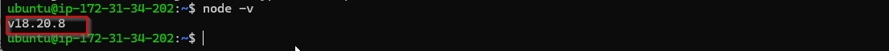
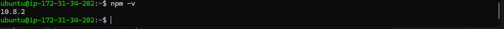
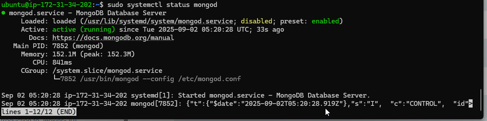
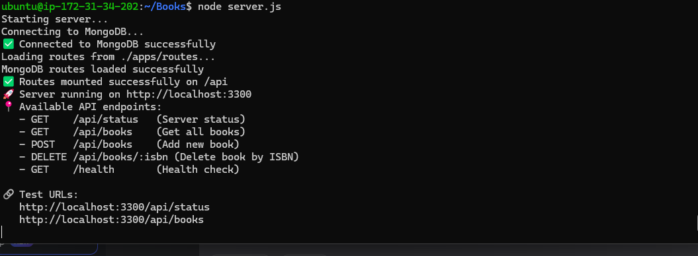
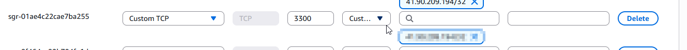
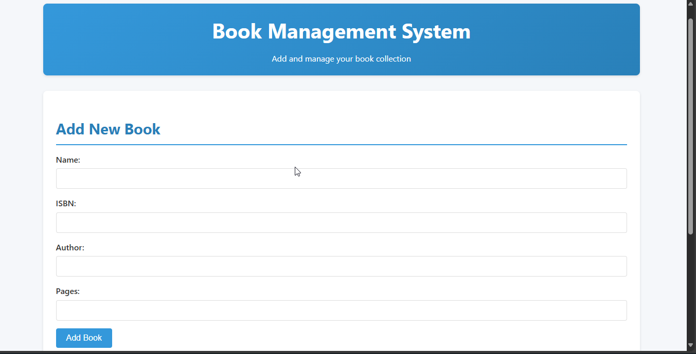
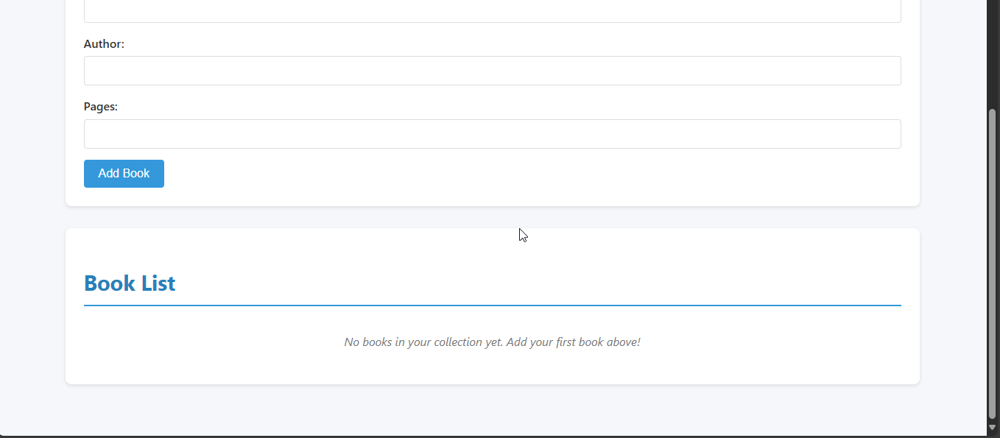

# MEAN STACK IMPLEMENTATION
## Project Overview
* This project follows the installation and configuration of MEAN stack on a Ubuntu server
* We will also create a basic book register web form

## Prerequesties
Before starting this guide, make sure you have:

1. **An AWS Account**  
   - You’ll need access to the [AWS Management Console](https://aws.amazon.com/console/) to create and manage your EC2 instance.  

2. **An EC2 Instance (Ubuntu 22.04 LTS recommended)**  
   - Minimum: t2.micro (Free Tier eligible) with 1 vCPU and 1 GB RAM.  
   - Security group configured to allow:  
     - **SSH** (port 22) — for remote terminal access.  
     - **HTTP** (port 80) — for web traffic.  
     - **HTTPS** (port 443) — optional, for secure web traffic.  

3. **SSH Key Pair**  
   - Downloaded when creating your EC2 instance.  
   - Keep it safe — it’s your login credential.

4. **Basic Terminal Knowledge**  
   - Ability to navigate the terminal and run commands like `cd`, `ls`, `sudo`.  

5. **Local Machine Requirements**  
   - A terminal (Linux/Mac) or **PowerShell**/**WSL** (Windows). (For this project I used both git bash and powershell)  
   - **SSH client** installed (most systems have it by default).  

6. **Text Editor**  
   - [VS Code](https://code.visualstudio.com/) or any preferred editor for editing configuration files. (I was using nano  and Vim on the Ubuntu server and VS code for the MD) 

7. **Stable Internet Connection**  
   - For installing packages and accessing your server remotely.

## 1. Install NodeJs
* Start by updating your system with the following commands
```bash 
sudo apt update && sudo apt ugrade
```
* Add the necessary certficates
```bash
sudo apt -y install curl dirmngr apt-transport-https lsb-release ca-certificates

curl -sL https://deb.nodesource.com/setup_18.x | sudo -E bash -
```
* Install nodejs and npm
```bash
curl -fsSL https://deb.nodesource.com/setup_18.x | sudo -E bash -
sudo apt-get install -y nodejs

```
* You can confirm that both are installed with the following commands
```bash
node -v
npm -v
```
* If successfully installed you should see the versions of both your node and npm

**Screenshots:**

 

 
 

 ## 2 Install MongoDB
 *  Install Tools and Import MongoDB's GPG Key
 ```bash
 sudo apt-get install -y gnupg curl
curl -fsSL https://www.mongodb.org/static/pgp/server-7.0.asc | \
   sudo gpg -o /usr/share/keyrings/mongodb-server-7.0.gpg \
   --dearmor
 ```
 *  Add the MongoDB Package Repository
 ```bash 
 echo "deb [ arch=amd64,arm64 signed-by=/usr/share/keyrings/mongodb-server-7.0.gpg ] https://repo.mongodb.org/apt/ubuntu jammy/mongodb-org/7.0 multiverse" | sudo tee /etc/apt/sources.list.d/mongodb-org-7.0.list
 ```
 * Install MongoDB
 ```bash
 sudo apt-get install -y mongodb-org
 ```
 * Start the server
 ```bash
 sudo systemctl start mongod
 ```
 * Verify that it is running
 ```bash
 sudo systemctl status mongod 
 ```
  **Screenshot**


* Install body-parser package to help us process JSON files passed in requests to the server
```bash
sudo npm install body-parser
```
* Create a folder named books and initialize it. Then add a file named server.js
```bash
mkdir Books && cd Books
npm init
vi server.js
```
* Paste the following code into your server.js
```js
const express = require('express');
const mongoose = require('mongoose');
const bodyParser = require('body-parser');
const path = require('path');
const fs = require('fs');
const app = express();
const PORT = process.env.PORT || 3300;

// Middleware
app.use(express.static(path.join(__dirname, 'public')));
app.use(bodyParser.json());
app.use(express.urlencoded({ extended: true }));

// Basic test route
app.get('/api/status', (req, res) => {
  res.json({
    message: 'Server is running!',
    timestamp: new Date().toISOString(),
    mongodb: mongoose.connection.readyState === 1 ? 'Connected' : 'Disconnected'
  });
});

// Use an async function to start the server
async function startServer() {
  try {
    console.log('Starting server...');
    console.log('Connecting to MongoDB...');

    // Await the MongoDB connection to ensure it's ready
    await mongoose.connect('mongodb://localhost:27017/bookstore');
    console.log('✅ Connected to MongoDB successfully');

    // Load and mount API routes
    const routesPath = './apps/routes';
    if (fs.existsSync(path.join(__dirname, routesPath + '.js'))) {
      console.log(`Loading routes from ${routesPath}...`);
      const routes = require(routesPath);
      app.use('/api', routes);
      console.log('✅ Routes mounted successfully on /api');
    } else {
      throw new Error(`Routes file not found at ${routesPath}`);
    }

    // Health check endpoint
    app.get('/health', (req, res) => {
      res.json({
        status: 'OK',
        uptime: process.uptime(),
        mongodb: mongoose.connection.readyState === 1 ? 'Connected' : 'Disconnected',
        timestamp: new Date().toISOString()
      });
    });

    // Catch-all route for Angular SPA
    app.get('*', (req, res) => {
      const indexPath = path.join(__dirname, 'public', 'index.html');
      if (fs.existsSync(indexPath)) {
        res.sendFile(indexPath);
      } else {
        res.status(404).json({
          message: 'Angular app would load here',
          note: 'Place your Angular build files in the public/ directory'
        });
      }
    });

    // Start server after everything is ready
    app.listen(PORT, () => {
      console.log(`🚀 Server running on http://localhost:${PORT}`);
      console.log('📍 Available API endpoints:');
      console.log('   - GET    /api/status   (Server status)');
      console.log('   - GET    /api/books    (Get all books)');
      console.log('   - POST   /api/books    (Add new book)');
      console.log('   - DELETE /api/books/:isbn (Delete book by ISBN)');
      console.log('   - GET    /health       (Health check)');
      console.log('');
      console.log('🔗 Test URLs:');
      console.log(`   http://localhost:${PORT}/api/status`);
      console.log(`   http://localhost:${PORT}/api/books`);
    });

  } catch (err) {
    console.error('❌ FAILED to start server:', err.message);
    process.exit(1); // Exit with a failure code
  }
}

// Call the async function to run the server
startServer();
```
## 3. Install Express and set up routes to the server
* We will use express to pass informatio to and from our MongoDB database
```bash
sudo npm install express mongoose
```
* In the 'Books' folder create a folder named apps and in it create a file called routes.js

```bash
mkdir apps && cd apps
vi routes.js
```
* Paste the following code into it
```js
const express = require('express');
const router = express.Router();
const Book = require('./models/book');

// GET all books
router.get('/books', async (req, res) => {
  try {
    const books = await Book.find();
    res.json(books);
  } catch (err) {
    console.error('Error fetching books:', err);
    res.status(500).json({ message: err.message });
  }
});

// ADD a new book
router.post('/books', async (req, res) => {
  try {
    console.log('Received book data:', req.body);
    const book = new Book(req.body);
    const savedBook = await book.save();
    res.status(201).json({
      message: 'Successfully added book',
      book: savedBook
    });
  } catch (err) {
    console.error('Error adding book:', err);
    res.status(400).json({ message: 'Error adding book', error: err.message });
  }
});

// DELETE a book by ISBN
router.delete('/books/:isbn', async (req, res) => {
  try {
    console.log('Deleting book with ISBN:', req.params.isbn);
    const result = await Book.findOneAndDelete({ isbn: req.params.isbn });
    if (!result) {
      return res.status(404).json({ message: 'Book not found' });
    }
    res.json({
      message: 'Successfully deleted the book',
      book: result
    });
  } catch (err) {
    console.error('Error deleting book:', err);
    res.status(500).json({ message: 'Error deleting book', error: err.message });
  }
});

// Test route to verify router is working
router.get('/test', (req, res) => {
  res.json({ message: 'Router is working correctly!' });
});

console.log('MongoDB routes loaded successfully');
module.exports = router;
 ```

* In the apps directory create another directory called models and create the book model within it
```bash
mkdir models && cd models
vi book.js
```
* Paste the followng code into book.js

```js
const mongoose = require('mongoose');

const bookSchema = new mongoose.Schema({
  name: { type: String, required: true },
  isbn: { type: String, required: true, unique: true, index: true },
  author: { type: String, required: true },
  pages: { type: Number, required: true, min: 1 }
}, {
  timestamps: true
});

module.exports = mongoose.model('Book', bookSchema);
```
## 4. Access the routes with Angular.js
* Change back into the books directory
* Create a folder called public and in it create a file called script.js
```bash
mkdir public && cd public
vi script.js
```
* Paste the following code into script.js
```js
angular.module('myApp', [])
  .controller('myCtrl', function($scope, $http) {

    // Initialize scope variables
    $scope.books = [];
    $scope.Name = '';
    $scope.Isbn = '';
    $scope.Author = '';
    $scope.Pages = '';

    // Function to fetch all books from the server
    function fetchBooks() {
      $http.get('/api/books')  // Fixed: changed from '/book' to '/api/books'
        .then(response => {
          $scope.books = response.data;
          console.log('Books loaded:', $scope.books);
        })
        .catch(error => {
          console.error('Error fetching books:', error);
          alert('Error fetching books. Please check the console.');
        });
    }

    // Load books when controller initializes
    fetchBooks();

    // Function to delete a book
    $scope.del_book = function(book) {
      if (confirm(`Are you sure you want to delete "${book.name}"?`)) {
        $http.delete(`/api/books/${book.isbn}`)  // Fixed: changed from '/book/' to '/api/books/'
          .then(() => {
            console.log('Book deleted successfully');
            fetchBooks(); // Refresh the list
          })
          .catch(error => {
            console.error('Error deleting book:', error);
            alert('Error deleting book. Please check the console.');
          });
      }
    };

    // Function to add a new book
    $scope.add_book = function() {
      // Validate form data
      if (!$scope.Name || !$scope.Isbn || !$scope.Author || !$scope.Pages) {
        alert('Please fill in all fields');
        return;
      }

      if ($scope.Pages <= 0) {
        alert('Pages must be a positive number');
        return;
      }

      const newBook = {
        name: $scope.Name,
        isbn: $scope.Isbn,
        author: $scope.Author,
        pages: parseInt($scope.Pages) // Fixed: added missing pages field and converted to number
      };

      console.log('Adding book:', newBook);

      $http.post('/api/books', newBook)  // Fixed: changed from '/book' to '/api/books'
        .then(response => {
          console.log('Book added successfully:', response.data);
          fetchBooks(); // Refresh the list
          // Clear form fields
          $scope.Name = '';
          $scope.Isbn = '';
          $scope.Author = '';
          $scope.Pages = '';
        })
        .catch(error => {
          console.error('Error adding book:', error);
          alert('Error adding book: ' + (error.data?.error || error.statusText));
        });
    };

    // Optional: Test function to check API connectivity
    $scope.test_api = function() {
      $http.get('/api/status')
        .then(response => {
          alert('API Test Success: ' + response.data.message);
          console.log('API Status:', response.data);
        })
        .catch(error => {
          alert('API Test Failed - Check console for details');
          console.error('API Test Error:', error);
        });
    };

  });
```
* Create the index.html file in the smae folder and paste the following code into it
```js
```
* Change back to the books directory
* Run the following command to start the server
```bash
node server.js
```
**Screenshot:**


**Note**
* If you keep getting the error below and are sure your code is correct
```
/home/ubuntu/Books/node_modules/path-to-regexp/dist/index.js:73
            throw new TypeError(`Missing parameter name at ${i}: ${DEBUG_URL}`);
            ^

TypeError: Missing parameter name at 1: https://git.new/pathToRegexpError
```
* Try downgrading to a more stable version of express

* Update the security group of your EC2 instance to allow traffic from port 3300

**Screenshot**


* View your application from your web browser using your instance public dns
```
http://<Public DNS>:3300
```
* It should appear as below
**Screenshot**



