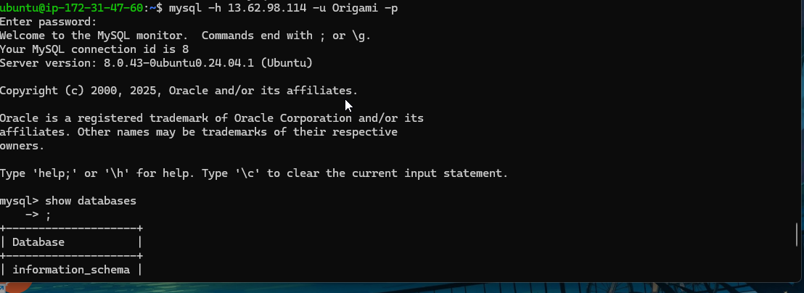
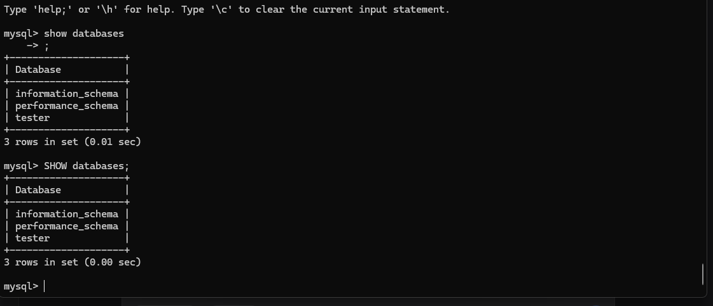

# MySQL Client-Server Architecture on AWS EC2

## Overview 🚀
Welcome to your new database universe! This guide will help you set up a MySQL client-server architecture using two AWS EC2 instances. Think of it as building a conversation between two machines - one does all the talking (server), and the other listens and responds (client).

## Meet Your Digital Duo 🤝

### 🏰 The Server Instance (The Knowledge Keeper)
- **Personality**: The organized librarian who remembers everything
- **Role**: MySQL Database Server - where your data lives permanently
- **Superpower**: Safely stores data and politely serves information to authorized guests
- **Secret Weapon**: MySQL Server installed and configured for visitors

### 📞 The Client Instance (The Curious Questioner)  
- **Personality**: The friendly neighbor who drops by to ask questions
- **Role**: Database Client - asks for information when needed
- **Superpower**: Can connect remotely and have meaningful conversations with the server
- **Secret Weapon**: MySQL Client utilities ready for adventure

## The Setup Journey 🗺️

### Phase 1: Preparing the Server (Setting Up the Library)

#### Install MySQL Server
```bash
sudo apt update && sudo apt install mysql-server -y
```

#### Secure Your Database Castle
```bash
sudo mysql_secure_installation
# Follow the prompts like a careful guardian setting up security systems
```

#### Open the Doors for Visitors
Edit the MySQL configuration:
```bash
sudo nano /etc/mysql/mysql.conf.d/mysqld.cnf
```

Change this line to welcome remote guests:
```ini
bind-address = 0.0.0.0  # Now accepting visitors from all neighborhoods!
```

#### Wake Up the Server with New Settings
```bash
sudo systemctl restart mysql
sudo systemctl enable mysql  # So it wakes up automatically every day
```

### Phase 2: Creating the Welcome Committee 🎪

#### Enter the MySQL Realm
```bash
sudo mysql -u root -p
```

#### Build Your Digital Kingdom
```sql
-- Create a shiny new database
CREATE DATABASE tester;

-- Hire a trusted gatekeeper (user)
CREATE USER 'Origami'@'<client_ip>' IDENTIFIED BY 'StrongPassword123!';

-- Give the guard keys to the kingdom
GRANT ALL PRIVILEGES ON tester.* TO 'Origami'@'<client_ip>';

-- Make the magic happen
FLUSH PRIVILEGES;

-- Exit gracefully
EXIT;
```

### Phase 3: Preparing the Client (Training the Messenger) 📨

#### Arm the Client with Communication Tools
```bash
sudo apt update && sudo apt install mysql-client -y
```

### Phase 4: Building the Bridge Between Worlds 🌉

#### Security Group Magic
- Allow inbound traffic on port 3306 from your client's IP
- Think of it as adding your client to the server's VIP guest list

### Phase 5: The Grand Connection Test 🎯

#### From the Client Instance, Reach Out:
```bash
mysql -h <server_public_ip> -u Origami -p
```

#### Once Connected, Explore Your Kingdom:
```sql
SHOW DATABASES;      -- "What libraries do you have?"
USE kingdom_db;      -- "Let's visit this specific library"
SHOW TABLES;         -- "What books are on the shelves?"
```

## Quality Assurance Checklist ✅

### On the Server Side:
```bash
# Is our librarian awake and working?
sudo systemctl status mysql

# Is she listening for visitors?
sudo netstat -tlnp | grep mysql

# Did we hire the right gatekeeper?
sudo mysql -u root -p -e "SHOW GRANTS FOR 'Origami'@'<client_ip>'"
```

### On the Client Side:
```bash
# Can we see the library from here?
telnet server_public_ip 3306

# Do we have our communication tools?
mysql --version
```

## Security Wisdom 🛡️

1. **Password Power**: Use passwords that would make a spy jealous
2. **Guest List Management**: Only allow trusted IP addresses to visit
3. **SSL Conversations**: Consider enabling encrypted conversations
4. **Regular Checkups**: Keep both instances updated and healthy
5. **Backup Plans**: Always have a copy of your precious data

## When Things Go sideways 🔧

### Common Hiccups:
- "Connection refused" → The library doors might be locked
- "Access denied" → Wrong secret handshake or password
- "Can't connect" → Network roadblocks in the way

### Detective Mode:
```bash
# Check the server's diary for clues
sudo tail -f /var/log/mysql/error.log

# Map the network route
traceroute server_public_ip
```


## Success Celebration 🎉
When you see that MySQL prompt from your client connecting to your server, take a moment to appreciate what you've built: two machines, potentially worlds apart, now having secure, meaningful conversations about data!

Remember: every great application starts with a good conversation between client and server. You've just built the foundation for something amazing!

 

 


---

*Now go forth and build something wonderful! Your digital kingdom awaits its first citizens (tables and data)!*
```

