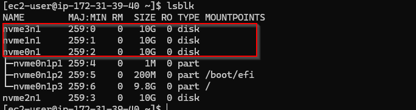
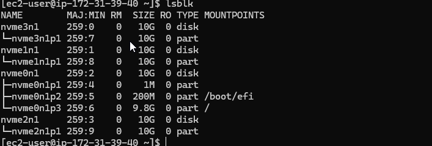
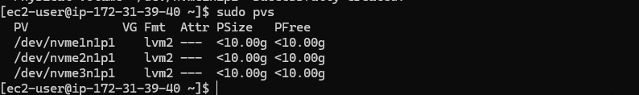
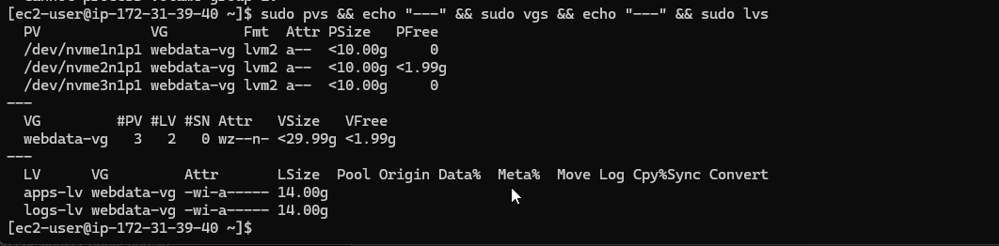
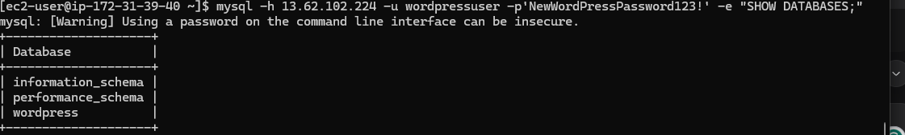
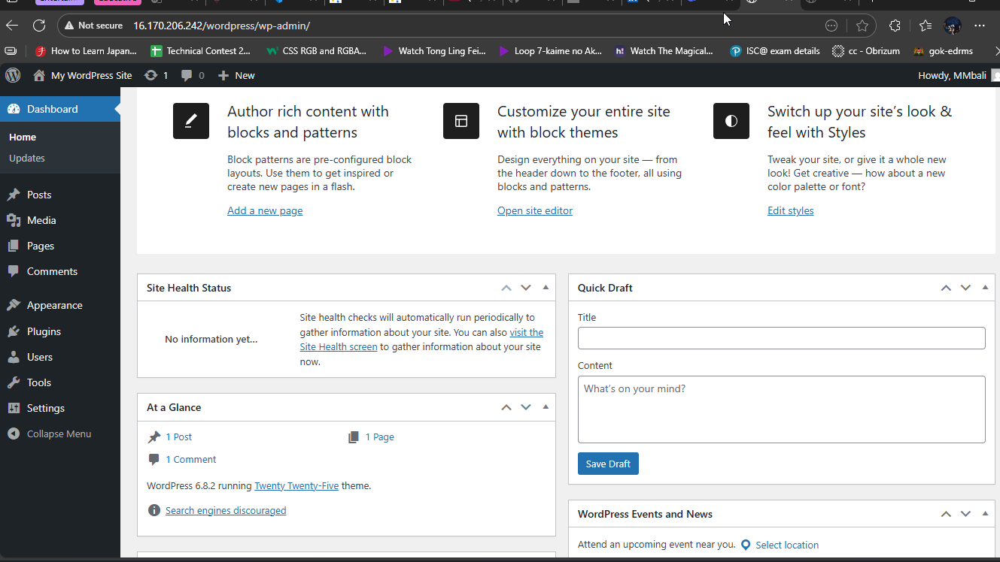
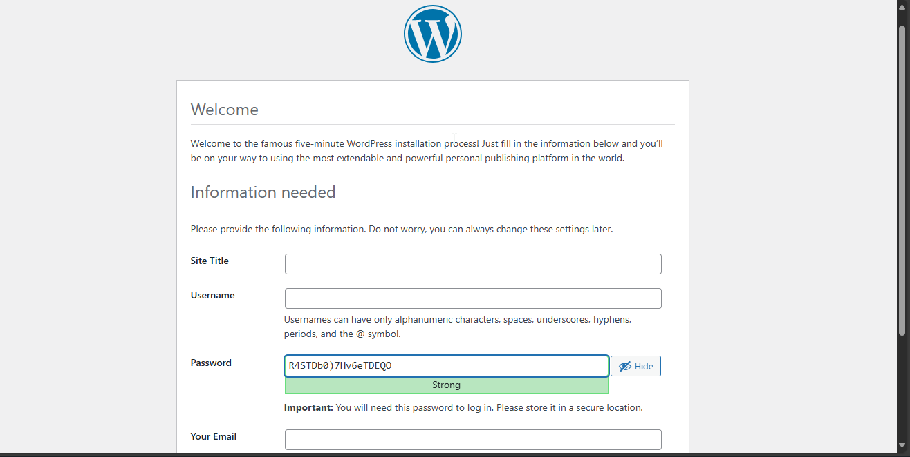

# WordPress Deployment on AWS with LVM Storage Management

## Project Overview
This project demonstrates how to configure Linux storage subsystem using LVM (Logical Volume Manager) and deploy a full-scale web solution using WordPress CMS with a remote MySQL database on AWS EC2 instances. The implementation uses three EBS volumes configured with LVM for optimal storage management.

## Architecture
- **Web Server**: Hosts WordPress application with LVM-configured storage
- **Database Server**: Hosts MySQL database with LVM-configured storage
- **Storage**: Three 10 GiB EBS volumes configured with LVM for optimal storage management

## Step-by-Step Implementation with Detailed Commands

### Step 1: Web Server Preparation

#### 1.1. EC2 Instance and EBS Volume Setup
```bash
# Launch RedHat EC2 instance as "Web Server" through AWS console
# Create 3 EBS volumes (10 GiB each) in the same Availability Zone
# Attach all volumes to the EC2 instance through AWS console
```

#### 1.2. Storage Configuration and Partitioning
```bash
# Connect to your EC2 instance via SSH
ssh -i your-key.pem ec2-user@your-ec2-public-ip

# Identify block devices
lsblk

ls /dev/

# Check current mounts and free space
df -h

# Create partitions on each volume using gdisk
sudo gdisk /dev/nvme3n1
# Within gdisk:
#   n → [Enter] → [Enter] → [Enter] → 8E00 → w → yes

sudo gdisk /dev/nvme2n1
# Repeat the same process

sudo gdisk /dev/nvme1n1
# Repeat the same process

# Verify partitions
lsblk
```
* Initial view of partitons
 
* Verification of partitons
  

#### 1.3. LVM Configuration
```bash
# Install LVM2 package
sudo yum install lvm2 -y

# Check for available partitions
sudo lvmdiskscan

# Create physical volumes
sudo pvcreate /dev/nvme1n1
sudo pvcreate /dev/nvme2n1
sudo pvcreate /dev/nvme3n1

# Verify physical volumes
sudo pvs
```
 

``` bash
# Create volume group
sudo vgcreate webdata-vg /dev/nvme3n1 /dev/nvme2n1 /dev/nvme1n1

# Verify volume group
sudo vgs

# Create logical volumes
sudo lvcreate -n apps-lv -L 14G webdata-vg
sudo lvcreate -n logs-lv -L 14G webdata-vg

# Verify logical volumes
sudo lvs
sudo vgdisplay -v
sudo lsblk
```
  
#### 1.4. Filesystem Setup and Mounting
```bash
# Format logical volumes with ext4 filesystem
sudo mkfs -t ext4 /dev/webdata-vg/apps-lv
sudo mkfs -t ext4 /dev/webdata-vg/logs-lv

# Create directories for mounting
sudo mkdir -p /var/www/html
sudo mkdir -p /home/recovery/logs

# Mount apps-lv to /var/www/html
sudo mount /dev/webdata-vg/apps-lv /var/www/html/

# Backup log files before mounting
sudo rsync -av /var/log/ /home/recovery/logs/

# Mount logs-lv to /var/log
sudo mount /dev/webdata-vg/logs-lv /var/log

# Restore log files
sudo rsync -av /home/recovery/logs/ /var/log
```


#### 1.5. Persistent Mount Configuration
```bash
# Get UUIDs of logical volumes
sudo blkid

# Edit fstab file to make mounts persistent
sudo vi /etc/fstab

# Add these lines to /etc/fstab (using your actual UUIDs):
UUID=your-apps-lv-uuid /var/www/html ext4 defaults 0 0
UUID=your-logs-lv-uuid /var/log ext4 defaults 0 0

# Test fstab configuration and reload daemon
sudo mount -a
sudo systemctl daemon-reload

# Verify setup
df -h
```

### Step 2: Database Server Preparation
```bash
# Repeat the same steps as for Web Server, but with these changes:

# Create db-lv instead of apps-lv
sudo lvcreate -n db-lv -L 14G webdata-vg

# Format the logical volume
sudo mkfs -t ext4 /dev/webdata-vg/db-lv

# Create mount directory and mount
sudo mkdir -p /db
sudo mount /dev/webdata-vg/db-lv /db

# Update /etc/fstab accordingly
```

### Step 3: WordPress Installation on Web Server

#### 3.1. Install Required Packages
```bash
# Update repository
sudo yum -y update

# Install wget, Apache and its dependencies
sudo yum -y install wget httpd php php-mysqlnd php-fpm php-json

# Start and enable Apache
sudo systemctl enable httpd
sudo systemctl start httpd

# Install PHP and dependencies
sudo yum install https://dl.fedoraproject.org/pub/epel/epel-release-latest-8.noarch.rpm
sudo yum install yum-utils http://rpms.remirepo.net/enterprise/remi-release-8.rpm
sudo yum module list php
sudo yum module reset php
sudo yum module enable php:remi-7.4
sudo yum install php php-opcache php-gd php-curl php-mysqlnd
sudo systemctl start php-fpm
sudo systemctl enable php-fpm
setsebool -P httpd_execmem 1

# Restart Apache
sudo systemctl restart httpd
```

#### 3.2. Download and Configure WordPress
```bash
# Create directory and download WordPress
mkdir wordpress
cd wordpress
sudo wget http://wordpress.org/latest.tar.gz
sudo tar -xzvf latest.tar.gz
sudo rm -rf latest.tar.gz

# Copy and configure WordPress
cp wordpress/wp-config-sample.php wordpress/wp-config.php
cp -R wordpress /var/www/html/

# Set proper permissions
sudo chown -R apache:apache /var/www/html/wordpress
sudo chcon -t httpd_sys_rw_content_t /var/www/html/wordpress -R
sudo setsebool -P httpd_can_network_connect=1
```

### Step 4: MySQL Installation on DB Server
```bash
# Update and install MySQL
sudo yum update
sudo yum install mysql-server

# Check status, restart and enable MySQL
sudo systemctl status mysqld
sudo systemctl restart mysqld
sudo systemctl enable mysqld
```

### Step 5: Database Configuration
```bash
# Access MySQL console
sudo mysql

# Within MySQL, execute these commands:
CREATE DATABASE wordpress;
CREATE USER 'myuser'@'<Web-Server-Private-IP-Address>' IDENTIFIED BY 'mypass';
GRANT ALL ON wordpress.* TO 'myuser'@'<Web-Server-Private-IP-Address>';
FLUSH PRIVILEGES;
SHOW DATABASES;
exit
```

### Step 6: WordPress to Database Connection

#### 6.1. Configure Security Groups
- Open MySQL port 3306 on DB Server EC2
- Allow access only from Web Server's IP address (/32)

#### 6.2. Test Connection and Finalize
```bash
# On Web Server, install MySQL client and test connection
sudo yum install mysql
sudo mysql -u myuser -p -h <DB-Server-Private-IP-address>

# In MySQL client, verify connection
SHOW DATABASES;

# Enable TCP port 80 in Inbound Rules for Web Server
# Access WordPress from browser: http://<Web-Server-Public-IP-Address>/wordpress/
```







## Verification Steps
1. **Storage Verification**: `df -h` should show mounted logical volumes
2. **Service Verification**: 
   - Web Server: `sudo systemctl status httpd`, `sudo systemctl status php-fpm`
   - DB Server: `sudo systemctl status mysqld`
3. **WordPress Access**: Successful loading of WordPress install page
4. **Database Connection**: WordPress successfully connects to remote MySQL database

## Security Considerations
- MySQL port 3306 restricted to Web Server IP only
- SELinux policies properly configured
- Appropriate file permissions set for Apache user
- Database user with limited privileges

## Cost Optimization
**Important**: Stop EC2 instances after completion to avoid unnecessary charges

## Troubleshooting Tips
1. If mount fails, check UUIDs in /etc/fstab
2. If WordPress can't write, check SELinux contexts and permissions
3. If database connection fails, verify security group rules and user privileges

## Technologies Used
- AWS EC2
- EBS Volumes
- LVM (Logical Volume Manager)
- Apache Web Server
- PHP
- MySQL
- WordPress CMS

This implementation demonstrates enterprise-grade web solution deployment with proper storage management, security practices, and high availability considerations. The use of LVM provides flexibility in storage management, allowing for easy expansion in the future.