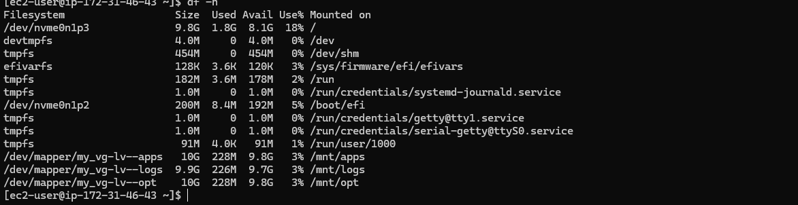
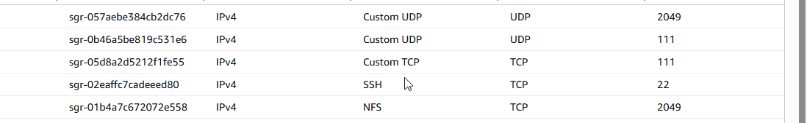
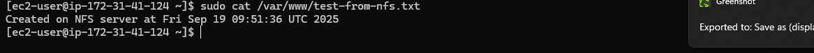
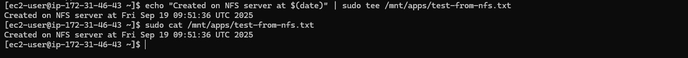
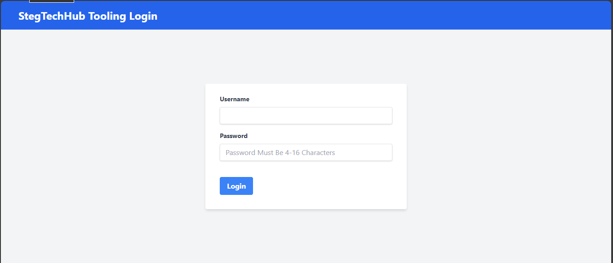
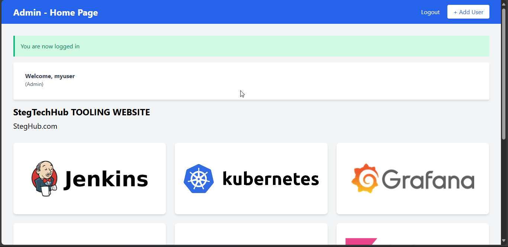

# Setting Up NFS Server, Database Server, and Web Servers

## Step 1 - Prepare NFS Server

### 1. Launch RHEL 8 EC2 Instance
- Spin up a new EC2 instance with RHEL Linux 8

### 2. Configure LVM with XFS
- Create physical volumes, volume group, and logical volumes
- Format as `xfs` 
- Create 3 Logical Volumes: `lv-opt`, `lv-apps`, and `lv-logs`

### 3. Create Mount Points
```bash
# Mount logical volumes
mkdir -p /mnt/apps
mkdir -p /mnt/logs
mkdir -p /mnt/opt

# Mount the logical volumes to these directories
mount /dev/mapper/vg_name-lv_apps /mnt/apps
mount /dev/mapper/vg_name-lv_logs /mnt/logs
mount /dev/mapper/vg_name-lv_opt /mnt/opt
```
 


### 4. Install and Configure NFS Server
```bash
sudo yum -y update
sudo yum install nfs-utils -y
sudo systemctl start nfs-server.service
sudo systemctl enable nfs-server.service
sudo systemctl status nfs-server.service
```

### 5. Set Permissions and Export Directories
```bash
sudo chown -R nobody: /mnt/apps
sudo chown -R nobody: /mnt/logs
sudo chown -R nobody: /mnt/opt

sudo chmod -R 777 /mnt/apps
sudo chmod -R 777 /mnt/logs
sudo chmod -R 777 /mnt/opt

sudo systemctl restart nfs-server.service
```

### 6. Configure NFS Exports
Edit `/etc/exports`:
```bash
/mnt/apps <Subnet-CIDR>(rw,sync,no_all_squash,no_root_squash)
/mnt/logs <Subnet-CIDR>(rw,sync,no_all_squash,no_root_squash)
/mnt/opt <Subnet-CIDR>(rw,sync,no_all_squash,no_root_squash)
```

Apply exports:
```bash
sudo exportfs -arv
```

### 7. Configure Firewall
```bash
# Check NFS ports
rpcinfo -p | grep nfs

# Open required ports in security group:
# - TCP 111
# - UDP 111
# - UDP 2049
# - Plus any additional ports shown by rpcinfo
```

## Step 2 - Configure Database Server

### 1. Install MySQL Server
```bash
sudo yum install mysql-server -y
sudo systemctl start mysqld
sudo systemctl enable mysqld
```

### 2. Secure MySQL Installation
```bash
sudo mysql_secure_installation
```

### 3. Create Database and User
```sql
CREATE DATABASE tooling;
CREATE USER 'webaccess'@'<webservers-subnet-cidr>' IDENTIFIED BY 'password';
GRANT ALL PRIVILEGES ON tooling.* TO 'webaccess'@'<webservers-subnet-cidr>';
FLUSH PRIVILEGES;
```


## Step 3 - Prepare Web Servers

### 1. Launch RHEL 8 EC2 Instances
- Launch 3 EC2 instances with RHEL 8

### 2. Install NFS Client
```bash
sudo yum install nfs-utils nfs4-acl-tools -y
```

### 3. Mount NFS Share
```bash
sudo mkdir /var/www
sudo mount -t nfs -o rw,nosuid <NFS-Server-Private-IP>:/mnt/apps /var/www
```


### 4. Make Mount Persistent
Edit `/etc/fstab`:
```bash
<NFS-Server-Private-IP>:/mnt/apps /var/www nfs defaults 0 0
```

### 5. Install Apache and PHP
```bash
sudo yum install httpd -y

sudo dnf install https://dl.fedoraproject.org/pub/epel/epel-release-latest-8.noarch.rpm
sudo dnf install dnf-utils http://rpms.remirepo.net/enterprise/remi-release-8.rpm
sudo dnf module reset php
sudo dnf module enable php:remi-7.4
sudo dnf install php php-opcache php-gd php-curl php-mysqlnd

sudo systemctl start php-fpm
sudo systemctl enable php-fpm
sudo systemctl start httpd
sudo systemctl enable httpd

setsebool -P httpd_execmem 1
```

### 6. Verify NFS Mount
```bash
df -h
# Create test file and verify it appears on other servers
touch /var/www/test.txt
```



### 7. Mount Log Directory
```bash
# Mount NFS logs directory to Apache log directory
sudo mount -t nfs -o rw,nosuid <NFS-Server-Private-IP>:/mnt/logs /var/log/httpd

# Add to /etc/fstab
<NFS-Server-Private-IP>:/mnt/logs /var/log/httpd nfs defaults 0 0
```

### 8. Deploy Tooling Application
```bash
# Clone your forked repository
cd /var/www/html
sudo git clone https://github.com/your-username/tooling.git .
```

### 9. Configure Database Connection
Edit `/var/www/html/functions.php` with database connection details:
```php
// Update database connection parameters
$dbhost = '<database-private-ip>';
$dbuser = 'webaccess';
$dbpass = 'password';
$dbname = 'tooling';
```

### 10. Import Database Schema
```bash
mysql -h <database-private-ip> -u webaccess -p tooling < tooling-db.sql
```

### 11. Create Admin User
```sql
INSERT INTO `users` (`id`, `username`, `password`, `email`, `user_type`, `status`) 
VALUES (1, 'myuser', '5f4dcc3b5aa765d61d8327deb882cf99', 'user@mail.com', 'admin', '1');
```

### 12. Configure Security
```bash
# Adjust permissions
sudo chown -R apache:apache /var/www/html
sudo chmod -R 755 /var/www/html

# If encountering 403 errors
sudo setenforce 0
sudo vi /etc/sysconfig/selinux  # Set SELINUX=disabled
sudo systemctl restart httpd
```

### 13. Test the Application
- Open web browser: `http://<Web-Server-Public-IP>/index.php`
- Login with username: `myuser`, password: `password`






## Important Notes

1. Replace `<Subnet-CIDR>`, `<NFS-Server-Private-IP>`, and `<database-private-ip>` with your actual values
2. Ensure proper security group rules for:
   - NFS ports (TCP/UDP 111, UDP 2049)
   - HTTP port 80
   - MySQL port 3306 (only from web servers)
3. Consider security implications of disabled SELinux in production
4. Use stronger passwords in production environments
5. Regularly update and patch all systems

## Verification

- Verify NFS mounts on all web servers with `df -h`
- Test file creation on one web server appears on others
- Verify database connection from web servers
- Test tooling application functionality through web interface

This setup creates a scalable web infrastructure with shared storage and a centralized database, allowing you to easily add or remove web servers as needed.