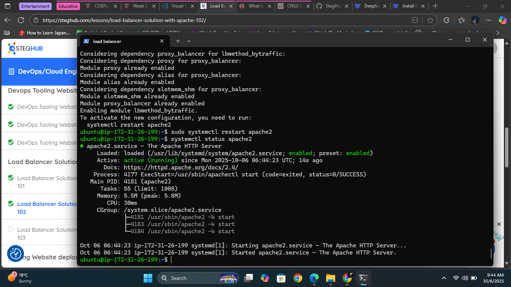
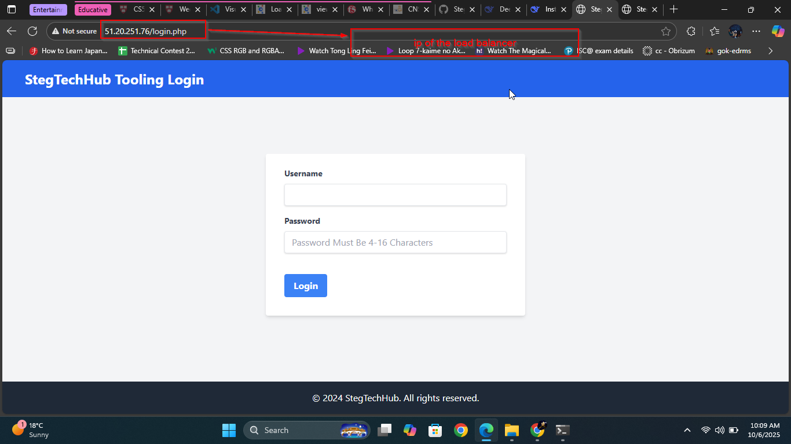
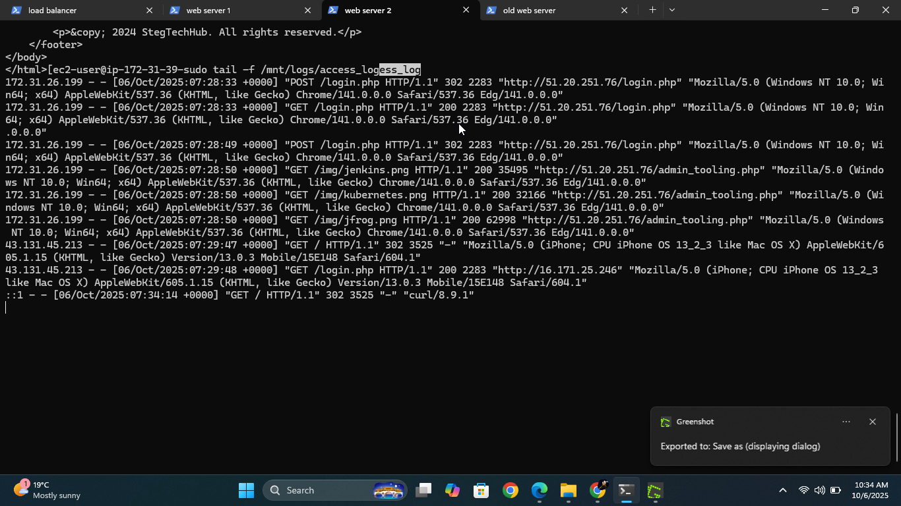
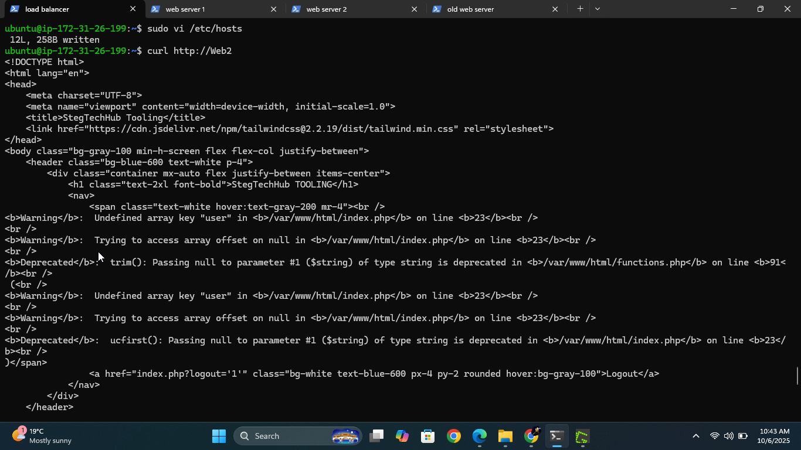

# Apache Load Balancer with Local DNS Setup

## 📋 Project Overview
This project sets up an Apache load balancer with local DNS resolution for distributing traffic across existing web servers. The web servers, NFS, and database were configured in a previous project.


## 🎯 Features
- **Apache Load Balancer** with mod_proxy_balancer
- **Local DNS resolution** using /etc/hosts
- **Easy hostname-based server management**


## ⚙️ Prerequisites
- **Existing Infrastructure**:
  - 2+ Web servers (configured in previous project)
  - NFS server (existing)
  - Database server (existing)
- **Load Balancer Server**: Fresh Ubuntu/CentOS instance
- **Network**: All servers in same VPC with private IP connectivity

## 🚀 Quick Setup

### 1. Configuring Apache As A Load Balancer
- Create a Ubuntu Server 20.04 instance and open TCP port 80 by creating an inbound rule in the security group
- Install apache load balancer on the server and configure it to point traffic coming LB to both servers
```bash
Install apache2
sudo apt update
sudo apt install apache2 -y
sudo apt-get install libxml2-dev

#Enable following modules:
sudo a2enmod rewrite
sudo a2enmod proxy
sudo a2enmod proxy_balancer
sudo a2enmod proxy_http
sudo a2enmod headers
sudo a2enmod lbmethod_bytraffic

#Restart apache2 service
sudo systemctl restart apache2
```
- Check on the status of the server



### 2. Configure Load Balancing
- Open the configuration file
```bash
sudo vi /etc/apache2/sites-available/000-default.conf
```
- Add this configuration file to the virtual host section

```bash

<Proxy "balancer://mycluster">
               BalancerMember http://< WebServer1-Private-IP-Address >:80 loadfactor=5 timeout=1
               BalancerMember http://< WebServer2-Private-IP-Address >:80 loadfactor=5 timeout=1
               ProxySet lbmethod=bytraffic
               # ProxySet lbmethod=byrequests
        </Proxy>

        ProxyPreserveHost On
        ProxyPass / balancer://mycluster/
        ProxyPassReverse / balancer://mycluster/

#Restart apache server

sudo systemctl restart apache2
```
- Verify that the configuration works



### 3. Logs
- If you had mounted your web server to the nfs server, unmount them and make sure each server has its own web directory
- SSH into an instance on both your web servers and run the following command on both terminals
```bash
sudo tail -f /var/log/httpd/access_log
```
- Refresh your browser severally to ensure both servers recieve http get requests




### 4. Configure Local DNS Setup
- Open the /etc/hosts file
- Add 2 records into this file with Local IP address and arbitrary name for both of your Web Servers
 
```bash
<WebServer1-Private-IP-Address> Web1
<WebServer2-Private-IP-Address> Web2
```
You can try to curl your web server locally and it should work




## 📊 Load Balancing Methods

### Available Algorithms:
- **byrequests** (default): Distributes based on request count
- **bytraffic**: Distributes based on bandwidth usage  
- **bybusyness**: Sends to least busy server
- **heartbeat**: Advanced health checking

### Session Persistence:
```apache
# For applications requiring session stickiness
ProxySet stickysession=JSESSIONID
```

## 🧪 Testing & Validation

### Test DNS Resolution:
```bash
nslookup web1
ping web2
curl -I http://web1/
```

### Test Load Balancer:
```bash
# Test basic functionality
curl http://localhost/

```


## 🛠️ Management Scripts

### Health Monitoring (`scripts/monitor-traffic.sh`)
```bash
#!/bin/bash
echo "=== Load Balancer Status ==="
sudo systemctl status apache2

echo "=== Active Connections ==="
sudo netstat -tulpn | grep :80

echo "=== Recent Log Entries ==="
sudo tail -n 5 /var/log/apache2/lb_access.log
```


## 🔍 Monitoring & Logs

### Key Log Files:
- `/var/log/apache2/lb_access.log` - Access logs
- `/var/log/apache2/lb_error.log` - Error logs
- `/var/log/apache2/error.log` - Apache errors


## 🚨 Troubleshooting

### Common Issues:
1. **Hostname not resolved**: Check `/etc/hosts` entries
2. **Web servers unreachable**: Verify network connectivity
3. **Apache not starting**: Check config with `apache2ctl configtest`
4. **503 errors**: Verify backend servers are running

## ✅ Verification Checklist

- [ ] Apache installed and running
- [ ] Required modules enabled
- [ ] /etc/hosts configured with server IPs
- [ ] Load balancer config deployed
- [ ] Backend servers accessible via hostnames
- [ ] Load balancing working (test with multiple requests)
- [ ] Logs being generated properly


## 📞 Support

For issues related to:
- **Load Balancer**: Check Apache logs and configuration
- **DNS Resolution**: Verify /etc/hosts entries
- **Backend Connectivity**: Test direct server access
- **Previous Project Setup**: Refer to prior project documentation

---

**Note**: This project assumes all backend services (web servers, NFS, database) are already configured and operational from the previous project.