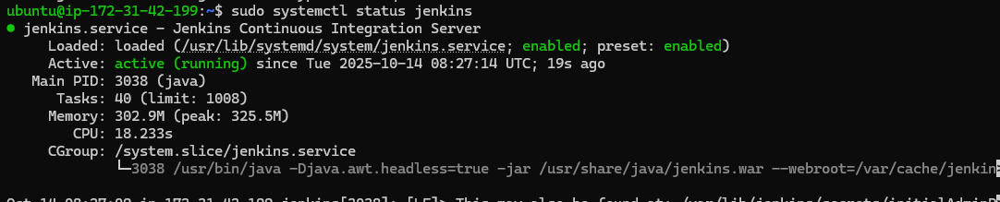
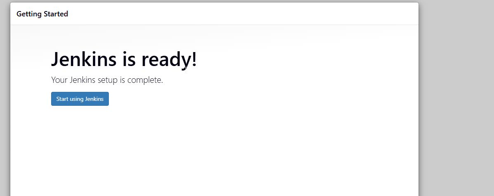
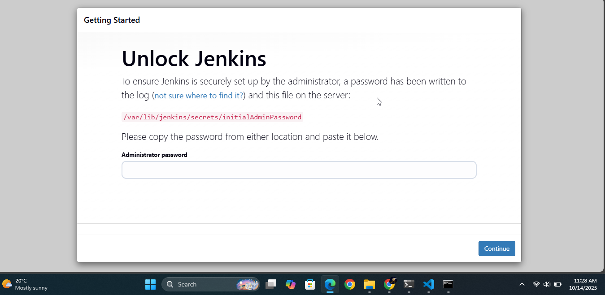
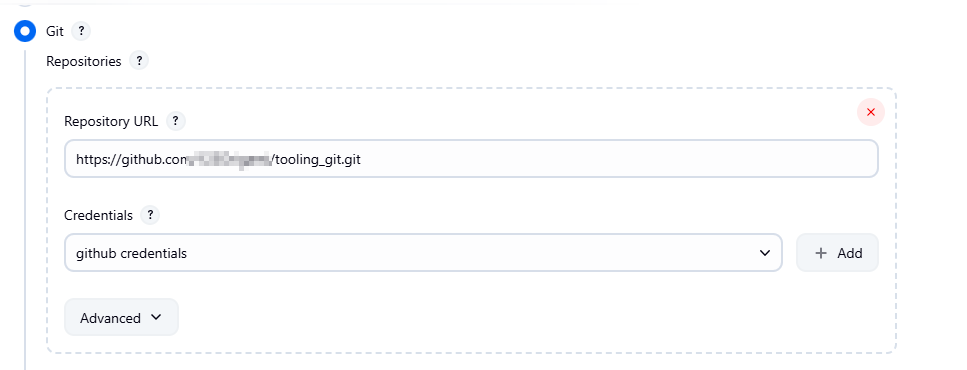
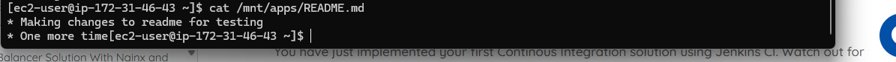

# Jenkins CI/CD Setup Guide

## Project Overview
This project demonstrates how to set up a complete Jenkins CI/CD pipeline that automatically retrieves code from GitHub and deploys it to an NFS server.

## Architecture
- **Jenkins Server**: Ubuntu 20.04 LTS EC2 instance
- **NFS Server**: RHEL 8 EC2 instance  
- **GitHub Repository**: Source code repository with webhooks
- **Communication**: SSH for file transfer between Jenkins and NFS server

## Prerequisites
- AWS EC2 instances for Jenkins and NFS servers
- GitHub repository with source code
- Basic knowledge of Linux commands
- SSH key pairs for EC2 instances

## Step-by-Step Implementation

### Step 1: Jenkins Server Setup

#### 1.1 Create Jenkins EC2 Instance
- Launch Ubuntu Server 20.04 LTS EC2 instance
- Name: "Jenkins"
- Open port 8080 in security group

#### 1.2 Install Java JDK
```bash
sudo apt update
sudo apt install default-jdk-headless
```

#### 1.3 Install Jenkins

```bash
sudo rm /etc/apt/sources.list.d/jenkins.list
sudo mkdir -p /etc/apt/keyrings
curl -fsSL https://pkg.jenkins.io/debian-stable/jenkins.io-2023.key | sudo gpg --dearmor -o /etc/apt/keyrings/jenkins.gpg
echo "deb [signed-by=/etc/apt/keyrings/jenkins.gpg] https://pkg.jenkins.io/debian-stable binary/" | sudo tee /etc/apt/sources.list.d/jenkins.list
sudo apt update
```

#### 1.4 Start and Verify Jenkins
```bash
sudo systemctl status jenkins
sudo systemctl enable jenkins
```


#### 1.5 Initial Jenkins Setup
- Access Jenkins at: `http://<JENKINS_SERVER_IP>:8080`



- Retrieve admin password:
  ```bash
  sudo cat /var/lib/jenkins/secrets/initialAdminPassword
  ```
- Install suggested plugins
- Create admin user



### Step 2: GitHub Webhook Configuration

#### 2.1 Configure GitHub Webhooks
- Go to GitHub repository → Settings → Webhooks
- Add webhook URL: `http://<JENKINS_IP>:8080/github-webhook/`
- Content type: `application/json`

#### 2.2 Create Jenkins Freestyle Project
- **New Item** → **Freestyle project**
- **Source Code Management**: Git
- Repository URL: `https://github.com/your-username/your-repo.git`
- Add GitHub credentials (username/password or token)



#### 2.3 Configure Build Triggers
- **Build Triggers**: GitHub hook trigger for GITScm polling

#### 2.4 Configure Post-build Actions
- **Archive the artifacts**: `**` (archive all files)

### Step 3: NFS Server Integration

#### 3.1 Install Publish Over SSH Plugin
- **Manage Jenkins** → **Manage Plugins** → **Available**
- Search and install "Publish Over SSH" plugin

#### 3.2 Configure SSH Connection to NFS Server
- **Manage Jenkins** → **Configure System**
- **Publish over SSH** section:
  - **Name**: `nfs-server`
  - **Hostname**: `<NFS_SERVER_PRIVATE_IP>`
  - **Username**: `ec2-user`
  - **Remote Directory**: `/mnt/apps`
  - **Private Key**: Paste your .pem file content

#### 3.3 Test SSH Connection
- Click **Test Configuration** - should return "Success"

#### 3.4 Configure Job to Copy Artifacts
- In your job configuration → **Post-build Actions**
- **Send build artifacts over SSH**:
  - **SSH Server**: Select your configured NFS server
  - **Source files**: `**`
  - **Remove prefix**: (empty)
  - **Remote directory**: (empty)

### Step 4: NFS Server Preparation

#### 4.1 Set Up Directory Permissions
```bash
# On NFS server
sudo mkdir -p /mnt/apps
sudo chown -R ec2-user:ec2-user /mnt/apps
sudo chmod -R 755 /mnt/apps
```

#### 4.2 Verify Security Groups
- Ensure NFS server security group allows SSH (port 22) from Jenkins server

## Testing the Pipeline

### Manual Test
1. Click **Build Now** in Jenkins
2. Check console output for success
3. Verify files in `/mnt/apps` on NFS server



### Automated Test
1. Make changes to any file in GitHub repository
2. Push changes to main branch
3. Webhook automatically triggers Jenkins build
4. Verify new files appear in `/mnt/apps`

## Expected Results

### Successful Build Output
```
SSH: Transferred X file(s)
Finished: SUCCESS
```

### File Verification
```bash
# On NFS server
ls -la /mnt/apps/
cat /mnt/apps/README.md
```

## Troubleshooting

### Common Issues

1. **Permission Denied** on NFS server:
   ```bash
   sudo chown -R ec2-user:ec2-user /mnt/apps
   sudo chmod -R 755 /mnt/apps
   ```

2. **SSH Connection Failed**:
   - Verify private IP address
   - Check security group rules
   - Test SSH manually from Jenkins server

3. **Webhook Not Triggering**:
   - Verify webhook URL format
   - Check GitHub repository permissions
   - Review Jenkins build triggers configuration

4. **No Files Transferred**:
   - Ensure build creates artifacts
   - Check "Source files" pattern in SSH transfer configuration
   - Verify post-build actions are properly configured

## Security Considerations

- Use IAM roles for EC2 instances when possible
- Regularly rotate SSH keys and GitHub tokens
- Keep Jenkins and plugins updated
- Restrict security group access to necessary ports only

## Maintenance

- Monitor Jenkins server disk space
- Regularly update Jenkins plugins
- Backup Jenkins configuration
- Monitor build history and success rates

## Conclusion

This setup provides a robust CI/CD pipeline that automatically deploys code changes from GitHub to your NFS server, enabling continuous integration and deployment for your applications.

---

*Note: Replace placeholder values (IP addresses, repository URLs, etc.) with your actual environment details.*