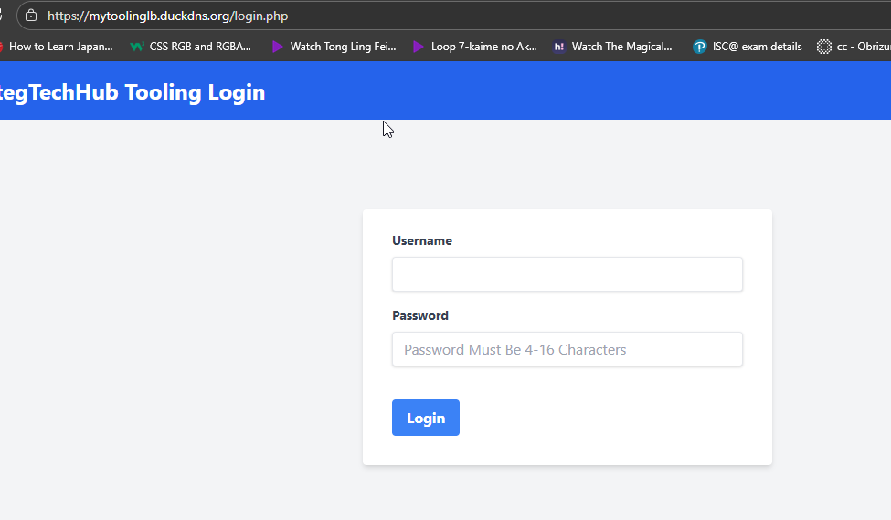

# Load Balancer with SSL/TLS - Complete Setup Guide

## 📋 Project Overview
This guide demonstrates how to set up an NGINX load balancer with a custom domain and valid SSL/TLS certificate using DuckDNS.

## 🎯 Architecture
```
User → DuckDNS Domain (mytoolinglb.duckdns.org) → NGINX Load Balancer → Backend Web Servers
```

## 🚀 Quick Start

### Prerequisites
- AWS EC2 instance for load balancer
- 3 backend web servers
- Elastic IP assigned to load balancer

## 📝 Step-by-Step Implementation

### Part 1: NGINX Load Balancer Setup

#### 1. Install NGINX
```bash
sudo apt update
sudo apt install nginx -y
sudo systemctl enable nginx
sudo systemctl start nginx
```

#### 2. Configure Load Balancer
Create `/etc/nginx/conf.d/load-balancer.conf`:
```nginx
upstream backend_servers {
    server <Server 1 IP Address>;   # web1
    server <Server 2 IP Address>;   # web2
}

server {
    listen 80;
    server_name _;
    
    location / {
        proxy_pass http://backend_servers;
        proxy_set_header Host $host;
        proxy_set_header X-Real-IP $remote_addr;
        proxy_set_header X-Forwarded-For $proxy_add_x_forwarded_for;
        proxy_set_header X-Forwarded-Proto $scheme;
        
        add_header X-Backend-Server $upstream_addr always;
    }
}
```

#### 3. Test Configuration
```bash
sudo nginx -t
sudo systemctl reload nginx
curl -I http://localhost/
```

### Part 2: Domain Registration with DuckDNS

#### 1. Get Free Domain from DuckDNS
1. Visit **[duckdns.org](https://www.duckdns.org)**
2. Sign in with GitHub or Google account (30 seconds)
3. Choose your subdomain (e.g., `mytoolinglb`)
4. Set IP address to your Elastic IP (e.g., `16.16.7.891`)
5. Click "Update IP"
6. You'll get: `mytoolinglb.duckdns.org`

#### 2. Verify DNS Resolution
```bash
nslookup mytoolinglb.duckdns.org
# Should return your Elastic IP

curl -I http://mytoolinglb.duckdns.org/
# Should connect to your load balancer
```

### Part 3: SSL/TLS Certificate Setup

#### 1. Install Certbot
```bash
sudo snap install --classic certbot
sudo ln -s /snap/bin/certbot /usr/bin/certbot
```

#### 2. Get SSL Certificate
```bash
sudo certbot --nginx -d mytoolinglb.duckdns.org
```

**Follow the prompts:**
- Enter email for security notices
- Accept Terms of Service
- Choose whether to subscribe to EFF mailing list
- Select option 2: "Redirect - Make all requests redirect to secure HTTPS access"

#### 3. Manual Configuration (If Auto-Config Fails)
If Certbot can't auto-configure NGINX, manually update `/etc/nginx/conf.d/load-balancer.conf`:

```nginx
upstream backend_servers {
   server <Server 1 IP Address>;   # web1
    server <Server 2 IP Address>;   # web2
}

# HTTP - Redirect to HTTPS
server {
    listen 80;
    server_name mytoolinglb.duckdns.org;
    return 301 https://mytoolinglb.duckdns.org$request_uri;
}

# HTTPS with SSL
server {
    listen 443 ssl;
    server_name mytoolinglb.duckdns.org;
    
    # SSL Configuration (from Certbot)
    ssl_certificate /etc/letsencrypt/live/mytoolinglb.duckdns.org/fullchain.pem;
    ssl_certificate_key /etc/letsencrypt/live/mytoolinglb.duckdns.org/privkey.pem;
    
    # SSL Security Settings
    ssl_protocols TLSv1.2 TLSv1.3;
    ssl_ciphers ECDHE-ECDSA-AES128-GCM-SHA256:ECDHE-RSA-AES128-GCM-SHA256:ECDHE-ECDSA-AES256-GCM-SHA384:ECDHE-RSA-AES256-GCM-SHA384;
    ssl_prefer_server_ciphers off;
    
    # Security Headers
    add_header Strict-Transport-Security "max-age=63072000" always;
    
    # Load Balancer Configuration
    location / {
        proxy_pass http://backend_servers;
        proxy_set_header Host $host;
        proxy_set_header X-Real-IP $remote_addr;
        proxy_set_header X-Forwarded-For $proxy_add_x_forwarded_for;
        proxy_set_header X-Forwarded-Proto $scheme;
        
        add_header X-Backend-Server $upstream_addr always;
    }
}
```

#### 4. Test and Apply Configuration
```bash
sudo nginx -t
sudo systemctl reload nginx
```

### Part 4: Verification & Testing

#### 1. Test SSL Certificate
```bash
# Test HTTPS access (no more -k flag needed!)
curl -I https://mytoolinglb.duckdns.org/

# Check certificate details
sudo certbot certificates

# Test certificate expiration
openssl s_client -connect mytoolinglb.duckdns.org:443 -servername mytoolinglb.duckdns.org 2>/dev/null | openssl x509 -noout -dates
```

#### 2. Test Load Balancing
```bash
# Test multiple requests to see load distribution
for i in {1..10}; do
    echo "Request $i:"
    curl -s https://mytoolinglb.duckdns.org/ | grep -o "X-Backend-Server:.*" | head -1
done
```

#### 3. Test HTTP to HTTPS Redirect
```bash
curl -I http://mytoolinglb.duckdns.org/
# Should show: 301 Moved Permanently to https://
```
Access your website url, you should see a padlock next to the site name indicating that it is secure


### Part 5: Automatic SSL Renewal

#### 1. Test Certificate Renewal
```bash
sudo certbot renew --dry-run
```

#### 2. Set Up Automatic Renewal
```bash
sudo crontab -e
```

Add this line (runs daily at noon):
```cron
0 12 * * * /usr/bin/certbot renew --quiet
```

### Part 6: Security Group Configuration

Ensure your AWS Security Group allows:
- **HTTP (port 80)** - for certificate verification
- **HTTPS (port 443)** - for secure traffic


### 🎯 Final Verification Script

```bash
#!/bin/bash
echo "=== LOAD BALANCER SSL VERIFICATION ==="
echo "Domain: mytoolinglb.duckdns.org"
echo

echo "1. Testing DNS resolution..."
nslookup mytoolinglb.duckdns.org

echo
echo "2. Testing HTTP to HTTPS redirect..."
curl -I http://mytoolinglb.duckdns.org/ 2>/dev/null | grep -i "location\|http"

echo
echo "3. Testing SSL certificate..."
curl -I https://mytoolinglb.duckdns.org/ 2>/dev/null | head -5

echo
echo "4. Testing load balancing..."
for i in {1..5}; do
    echo -n "Request $i: "
    curl -s https://mytoolinglb.duckdns.org/ | grep -o "X-Backend-Server:.*" | head -1
done

echo
echo "5. Certificate details:"
sudo certbot certificates

echo
echo "=== SETUP COMPLETE ==="
echo "✅ Access your secured load balancer at:"
echo "   https://mytoolinglb.duckdns.org"
echo "✅ Green padlock in browser"
echo "✅ Automatic SSL renewal configured"
```

## ✅ What You've Accomplished

- ✅ **NGINX load balancer** with 3 backend servers
- ✅ **Free custom domain** with DuckDNS
- ✅ **Valid SSL certificate** from Let's Encrypt
- ✅ **HTTP to HTTPS automatic redirect**
- ✅ **Automatic certificate renewal**
- ✅ **Professional, production-ready setup**

## 🔗 Access Your Application

**Primary URL:** `https://mytoolinglb.duckdns.org`

## 📊 Monitoring

Check certificate status:
```bash
sudo certbot certificates
```

Monitor NGINX logs:
```bash
sudo tail -f /var/log/nginx/access.log
sudo tail -f /var/log/nginx/error.log
```

## 🆓 Total Cost: $0

- **Domain:** Free from DuckDNS
- **SSL Certificate:** Free from Let's Encrypt
- **Infrastructure:** AWS Free Tier eligible

This setup provides a professional, fully-secured load balancer with a custom domain at no cost!